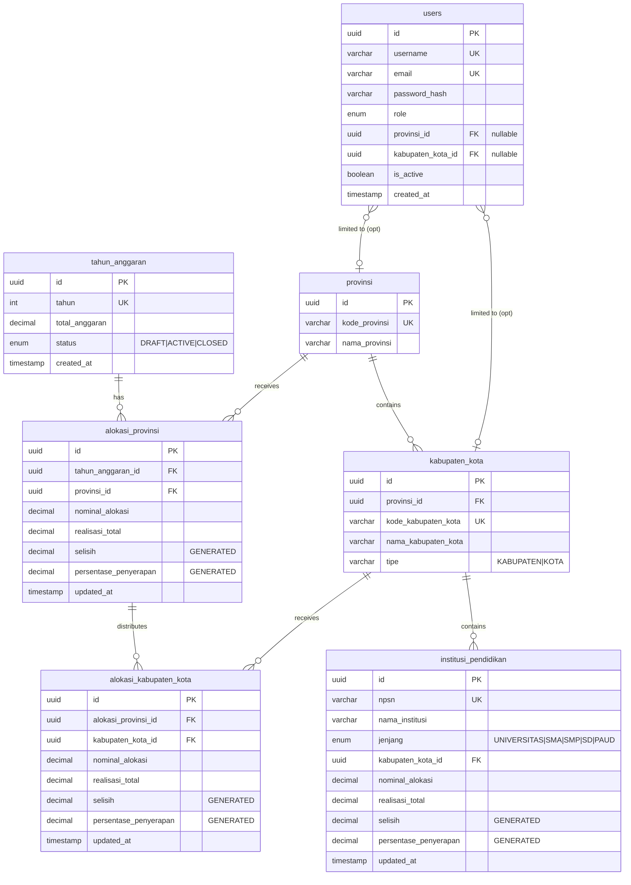
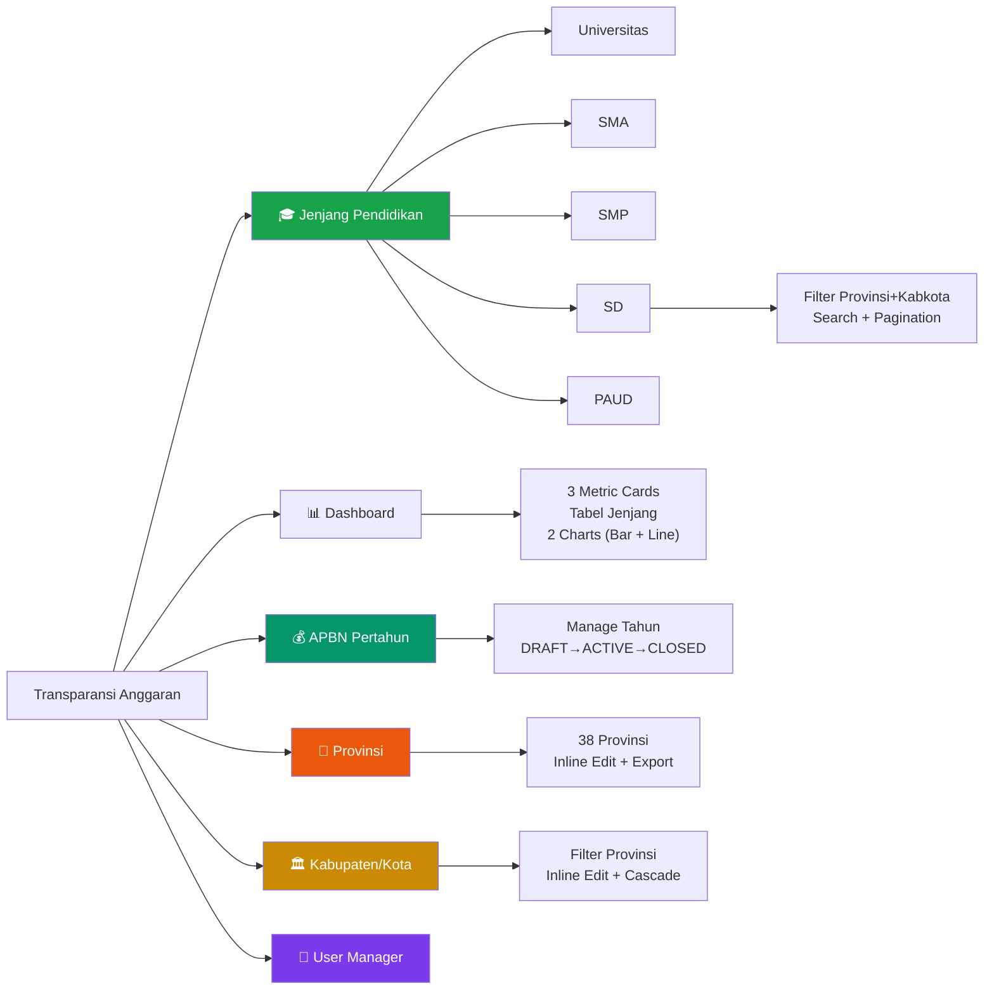
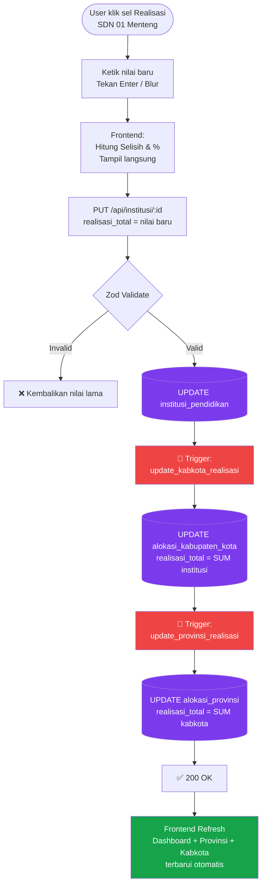
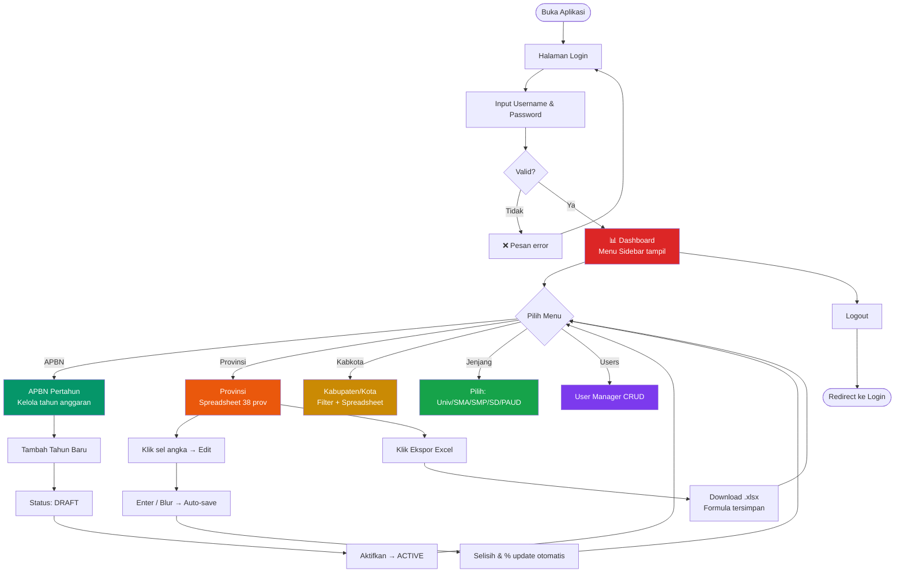
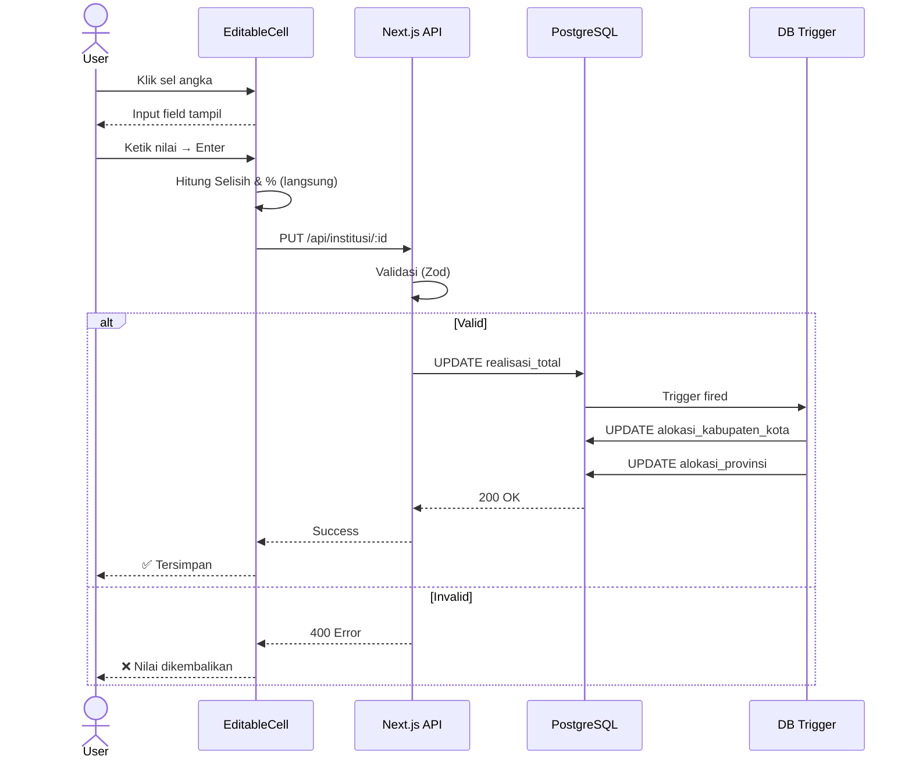
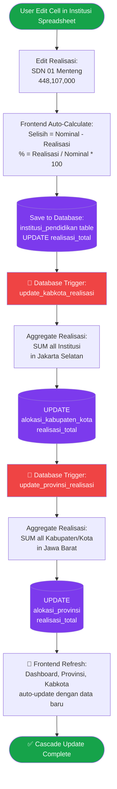
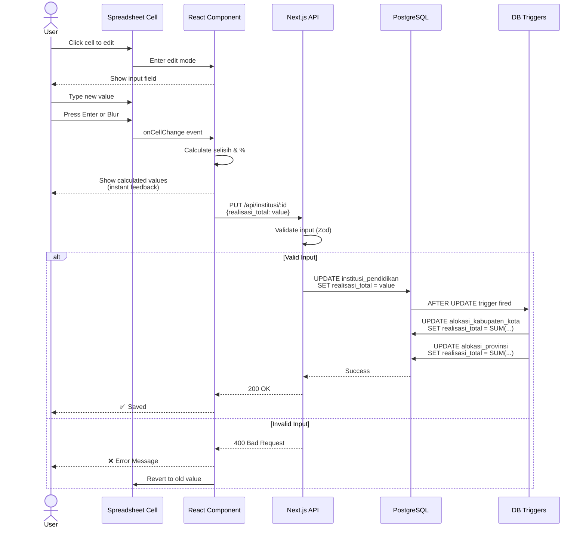

# PRD — Sistem Transparansi Anggaran Pendidikan Indonesia
**Version:** 3.1 (Updated — InsForge Integration)  
**Date:** 28 Mei 2026  
**Status:** ✅ IN DEVELOPMENT — Live at https://742jpk8a.insforge.site  
**Project Type:** Web-Based Spreadsheet Dashboard — Education Budget Transparency

---

## DAFTAR ISI

1. [Project Overview](#1-project-overview)
2. [Menu Structure](#2-menu-structure)
3. [Fitur per Menu](#3-fitur-per-menu)
4. [Database Schema](#4-database-schema)
5. [API Endpoints](#5-api-endpoints)
6. [Tech Stack & Frontend Structure](#6-tech-stack--frontend-structure)
7. [System Diagrams](#7-system-diagrams)
8. [MVP Roadmap — 4 Sprint (8 Minggu)](#8-mvp-roadmap--4-sprint-8-minggu)
9. [Success Metrics](#9-success-metrics)
10. [Deployment Plan](#10-deployment-plan)

---

## 1. Project Overview

### 1.1 Deskripsi Aplikasi
Sistem Transparansi Anggaran Pendidikan adalah aplikasi web berbasis **spreadsheet interface** untuk menampilkan, mengelola, dan mengaudit aliran dana pendidikan Indonesia dari tingkat nasional (APBN) hingga institusi pendidikan di seluruh daerah. Tampilannya menyerupai Excel/Google Sheets dengan semua kalkulasi angka terhubung secara real-time antar menu dan database.

### 1.2 Target User & Role

| Role | Akses | Keterangan |
|------|-------|------------|
| `SUPER_ADMIN` | Full access | Semua menu, termasuk User Manager |
| `ADMIN` | Create, Read, Update | Semua menu data anggaran |
| `ADMIN_PROVINSI` | CRUD untuk provinsinya | Terbatas pada wilayah provinsi |
| `ADMIN_KABKOTA` | CRUD untuk kabkotanya | Terbatas pada wilayah kabkota |
| `VIEWER` | Read-only | Semua menu, tidak bisa edit |
| `AUDITOR` | Read-only + Export | Semua menu, fokus audit trail |

### 1.3 Core Concept: Spreadsheet-Like Interface
- **Tampilan seperti Excel** — table rows & columns, sticky header & footer
- **Inline Editing** — klik sel angka langsung edit, tekan Enter/Tab untuk simpan
- **Kalkulasi Real-Time** — `Selisih = Nominal − Realisasi`, `% = (Realisasi / Nominal) × 100`
- **Conditional Formatting** — badge warna: 🟢 ≥80%, 🟡 50–79%, 🔴 <50%
- **Cascade Update** — edit Institusi → auto-update Kabkota → auto-update Provinsi → auto-update Dashboard
- **Export Excel** — download `.xlsx` dengan formula Excel tersimpan, bukan nilai statis

### 1.4 Business Goals
1. Seluruh aliran dana pendidikan dapat ditelusuri dari APBN hingga institusi
2. Realisasi penyerapan anggaran terpantau secara real-time
3. Mengurangi risiko kebocoran dengan transparansi data publik
4. Memudahkan audit oleh KPK dan BPK
5. Laporan yang sebelumnya manual (2 minggu) dipercepat menjadi otomatis (<1 hari)

---

## 2. Menu Structure

```
📊 Dashboard (Main)
   └── Ringkasan nasional: Nominal, Realisasi, % + Chart

💰 APBN Pertahun
   └── Kelola tahun anggaran: DRAFT → ACTIVE → CLOSED

📍 Provinsi
   └── Spreadsheet 38 provinsi, inline editing

🏛️ Kabupaten / Kota
   └── Filter per provinsi, inline editing

🎓 Jenjang Pendidikan
   ├── Universitas
   ├── SMA
   ├── SMP
   ├── SD
   └── PAUD

👥 User Manager
   └── CRUD users + role assignment
```

---

## 3. Fitur per Menu

### 3.1 Dashboard
**URL:** `/dashboard`

**Layout:**
```
┌──────────────────────────────────────────────────────────┐
│  TRANSPARANSI ANGGARAN PENDIDIKAN        Tahun: [2026 ▼] │
├──────────────────┬──────────────────┬────────────────────┤
│ Total Nominal    │ Total Realisasi  │ % Penyerapan       │
│ 769,1 T          │ 500,4 T          │ 65,1%              │
├──────────────────┴──────────────────┴────────────────────┤
│ Ringkasan per Jenjang                                    │
│  Jenjang     │ Nominal  │ Realisasi │ %    │ Progress    │
│  Universitas │ 150,0 T  │  98,0 T   │66,7% │ ████░░░░   │
│  SMA         │ 200,0 T  │ 130,0 T   │65,0% │ ████░░░░   │
│  SMP         │ 180,0 T  │ 118,0 T   │65,6% │ ████░░░░   │
│  SD          │ 200,0 T  │ 126,0 T   │63,0% │ ████░░░░   │
│  PAUD        │  39,1 T  │  28,4 T   │72,6% │ █████░░░   │
├──────────────────────────────────────────────────────────┤
│ [Bar Chart: Nominal vs Realisasi] [Line: Tren 2020-2026] │
└──────────────────────────────────────────────────────────┘
```

**Fitur:**
- 3 metric card: Total Nominal, Total Realisasi, % Penyerapan Nasional
- Tabel ringkasan per jenjang dengan progress bar
- Bar chart Nominal vs Realisasi per jenjang (Recharts)
- Line chart tren APBN 2020–2026 (Recharts)
- Dropdown tahun anggaran (header kanan atas, global)
- Auto-refresh saat data di menu lain berubah

---

### 3.2 APBN Pertahun
**URL:** `/dashboard/apbn`

**Layout:**
```
┌────────────────────────────────────────────────────────────────────┐
│ APBN PERTAHUN                        [+ Tambah Tahun]             │
├────┬───────┬───────────────────────────────┬──────────┬───────────┤
│ No │ Tahun │ Total Anggaran (APBN Pendidikan│ Status   │ Aksi      │
├────┼───────┼────────────────────────────────┼──────────┼───────────┤
│  1 │ 2020  │ 473.700.000.000.000            │ CLOSED   │ Lihat     │
│  2 │ 2021  │ 472.600.000.000.000            │ CLOSED   │ Lihat     │
│  3 │ 2022  │ 472.600.000.000.000            │ CLOSED   │ Lihat     │
│  4 │ 2023  │ 612.200.000.000.000            │ CLOSED   │ Lihat     │
│  5 │ 2024  │ 665.000.000.000.000            │ CLOSED   │ Lihat     │
│  6 │ 2025  │ 722.600.000.000.000            │ CLOSED   │ Lihat     │
│  7 │ 2026  │ 769.100.000.000.000 ✏️         │ ACTIVE ✓ │ Tutup     │
│  8 │ 2027  │ 0 ✏️                           │ DRAFT    │ Aktifkan  │
└────┴───────┴────────────────────────────────┴──────────┴───────────┘
  ✏️ = cell bisa diklik untuk edit langsung
```

**Status lifecycle:**
```
DRAFT → ACTIVE → CLOSED
  ↓        ↓         ↓
 Baru   Berjalan  Arsip (read-only)
```

**Aturan validasi:**
- Hanya **1 tahun** boleh berstatus `ACTIVE` dalam satu waktu
- Klik "Aktifkan" → tahun ACTIVE lama otomatis berubah ke CLOSED
- Tahun `CLOSED` tidak bisa diedit (read-only, untuk audit trail)
- Tidak bisa hapus tahun yang sudah punya data alokasi provinsi

**Aksi per status:**

| Status | Edit Total | Aktifkan | Tutup | Hapus | Lihat |
|--------|-----------|----------|-------|-------|-------|
| DRAFT  | ✅ | ✅ | ❌ | ✅ | ✅ |
| ACTIVE | ✅ | ❌ | ✅ | ❌ | ✅ |
| CLOSED | ❌ | ❌ | ❌ | ❌ | ✅ |

**Integrasi:** Dropdown "Tahun" di header global mengambil list dari tabel ini. Default = tahun ACTIVE.

---

### 3.3 Provinsi
**URL:** `/dashboard/provinsi`

**Layout:**
```
┌──────────────────────────────────────────────────────────────────────────┐
│ PROVINSI — TAHUN 2026        [🔍 Cari provinsi...]    [⬇ Ekspor Excel]  │
├────┬──────────────────────┬──────────────────┬──────────────┬────────┬───┤
│ No │ Nama Provinsi        │ Nominal (Rp)     │ Realisasi(Rp)│ Selisih│ % │
├────┼──────────────────────┼──────────────────┼──────────────┼────────┼───┤
│  1 │ Aceh                 │ 15.200.000.000   │ 9.800.000.000│  5.4 T │🟡 │
│  2 │ Sumatera Utara       │ 22.400.000.000   │16.200.000.000│  6.2 T │🟡 │
│ ...│ ...                  │ ✏️ klik edit     │ ✏️ klik edit │  auto  │auto│
│ 38 │ Papua Barat Daya     │  4.800.000.000   │ 2.100.000.000│  2.7 T │🔴 │
├────┼──────────────────────┼──────────────────┼──────────────┼────────┼───┤
│    │ TOTAL (38 Provinsi)  │ 769.100.000.000  │500.400.000.000│268.7T │🟡 │
└────┴──────────────────────┴──────────────────┴──────────────┴────────┴───┘
```

**Fitur:**
- Inline edit sel Nominal dan Realisasi (klik langsung)
- Selisih dan % dihitung otomatis di frontend dan database (generated column)
- Search filter by nama provinsi
- Total row sticky di bawah tabel
- Export ke `.xlsx` dengan formula Excel tersimpan

---

### 3.4 Kabupaten / Kota
**URL:** `/dashboard/kabupaten-kota`

**Layout:**
```
┌──────────────────────────────────────────────────────────────────────────┐
│  KABUPATEN/KOTA  [Provinsi: Jawa Barat ▼]  [🔍 Cari...]  [⬇ Ekspor]   │
├────┬─────────────────────┬──────────────┬─────────────┬─────────┬──────┬─┤
│ No │ Kabupaten / Kota    │ Provinsi     │ Nominal(Rp) │ Real(Rp)│Selisi│%│
├────┼─────────────────────┼──────────────┼─────────────┼─────────┼──────┼─┤
│  1 │ Kabupaten Bogor     │ Jawa Barat   │ 4.200.000   │ 3.100.00│  1.1T│🟢│
│  2 │ Kota Bandung        │ Jawa Barat   │ 3.800.000   │ 2.900.00│  0.9T│🟢│
│ ...│ ...                 │ ...          │ ✏️          │ ✏️      │ auto │  │
├────┼─────────────────────┼──────────────┼─────────────┼─────────┼──────┼─┤
│    │ TOTAL               │              │ 20.240.000  │15.000.00│  5.2T│🟡│
└────┴─────────────────────┴──────────────┴─────────────┴─────────┴──────┴─┘
```

**Fitur:**
- Filter dropdown Provinsi (cascading)
- Search by nama kabupaten/kota
- Inline edit + cascade update ke Provinsi secara otomatis
- Jumlah kabupaten/kota yang ditampilkan tertera di toolbar

---

### 3.5 Jenjang Pendidikan (5 Sub-Menu)
**URL:** `/dashboard/jenjang/[universitas|sma|smp|sd|paud]`

Satu komponen reusable (`InstitusiTable`) untuk 5 jenjang berbeda via dynamic route.

**Layout (contoh: SD):**
```
┌────────────────────────────────────────────────────────────────────────────────┐
│ JENJANG: SD   [Provinsi: Semua ▼]  [🔍 Cari nama SD...]   [⬇ Ekspor]  10 inst│
├────┬─────────────────────┬────────────────┬──────────────┬─────────────┬───────┤
│ No │ Nama SD             │ Kabupaten/Kota │ Provinsi     │ Nominal(Rp) │ Real  │
├────┼─────────────────────┼────────────────┼──────────────┼─────────────┼───────┤
│  1 │ SDN 01 Menteng      │ Jakarta Pusat  │ DKI Jakarta  │ 800.000.000 │474 Jt │
│  2 │ SDN 02 Bend. Hilir  │ Jakarta Pusat  │ DKI Jakarta  │ 750.000.000 │510 Jt │
│ ...│ ...                 │ ...            │ ...          │ ✏️          │ ✏️    │
├────┼─────────────────────┼────────────────┼──────────────┼─────────────┼───────┤
│    │ TOTAL (10)          │                │              │ 7.060.000   │4.784 M│
└────┴─────────────────────┴────────────────┴──────────────┴─────────────┴───────┘
```

**Fitur:**
- Filter cascading: Provinsi → Kabupaten/Kota
- Search by nama institusi
- Inline edit Nominal dan Realisasi
- Cascade update: edit Institusi → update Kabkota → update Provinsi
- Pagination 100 item/halaman (untuk SD ~150.000 data)
- Import bulk dari Excel (untuk input massal)

---

### 3.6 User Manager
**URL:** `/dashboard/users`

**Layout:**
```
┌─────────────────────────────────────────────────────────────────────────────┐
│ USER MANAGER            [+ Tambah User]   [🔍 Cari user...]    8 users     │
├────┬─────────────────────┬───────────────────────┬──────────────┬──────┬───┤
│ No │ User                │ Email                 │ Role         │Status│Aksi│
├────┼─────────────────────┼───────────────────────┼──────────────┼──────┼───┤
│  1 │ [SA] Super Admin    │ admin@kemdikbud.go.id │ Super Admin  │Aktif │Edit│
│  2 │ [AF] Ahmad Fauzi    │ a.fauzi@kemdikbud.id  │ Admin        │Aktif │Edit│
│  3 │ [SD] Sari Dewi      │ s.dewi@jabar.go.id    │ Admin Provinsi│Aktif│Edit│
│ ...│ ...                 │ ...                   │ ...          │ ...  │ ...│
└────┴─────────────────────┴───────────────────────┴──────────────┴──────┴───┘
```

**Fitur:**
- CRUD: Tambah, Edit (modal form), Hapus (soft delete)
- Role assignment: SUPER_ADMIN, ADMIN, ADMIN_PROVINSI, ADMIN_KABKOTA, VIEWER, AUDITOR
- Badge status: Aktif (hijau) / Non-aktif (merah)
- Search by nama, email, atau role
- SUPER_ADMIN tidak bisa dihapus

---

## 4. Database Schema

### 4.1 Entity Relationship Diagram



### 4.2 DDL Tabel Utama

```sql
-- Tahun Anggaran
CREATE TABLE tahun_anggaran (
  id            UUID PRIMARY KEY DEFAULT gen_random_uuid(),
  tahun         INT UNIQUE NOT NULL,
  total_anggaran DECIMAL(15,2) NOT NULL,
  status        VARCHAR(10) DEFAULT 'DRAFT',  -- DRAFT | ACTIVE | CLOSED
  created_at    TIMESTAMP DEFAULT NOW()
);

-- Provinsi (master data)
CREATE TABLE provinsi (
  id             UUID PRIMARY KEY DEFAULT gen_random_uuid(),
  kode_provinsi  VARCHAR(10) UNIQUE,
  nama_provinsi  VARCHAR(255) NOT NULL
);

-- Alokasi per Provinsi
CREATE TABLE alokasi_provinsi (
  id                    UUID PRIMARY KEY DEFAULT gen_random_uuid(),
  tahun_anggaran_id     UUID REFERENCES tahun_anggaran(id),
  provinsi_id           UUID REFERENCES provinsi(id),
  nominal_alokasi       DECIMAL(15,2) NOT NULL,
  realisasi_total       DECIMAL(15,2) DEFAULT 0,
  selisih               DECIMAL(15,2) GENERATED ALWAYS AS
                          (nominal_alokasi - realisasi_total) STORED,
  persentase_penyerapan DECIMAL(5,2)  GENERATED ALWAYS AS
                          (CASE WHEN nominal_alokasi > 0
                           THEN (realisasi_total / nominal_alokasi) * 100
                           ELSE 0 END) STORED,
  updated_at            TIMESTAMP DEFAULT NOW()
);

-- Kabupaten / Kota (master data)
CREATE TABLE kabupaten_kota (
  id                    UUID PRIMARY KEY DEFAULT gen_random_uuid(),
  provinsi_id           UUID REFERENCES provinsi(id),
  kode_kabupaten_kota   VARCHAR(10) UNIQUE,
  nama_kabupaten_kota   VARCHAR(255) NOT NULL,
  tipe                  VARCHAR(20)  -- KABUPATEN | KOTA
);

-- Alokasi per Kabupaten/Kota
CREATE TABLE alokasi_kabupaten_kota (
  id                    UUID PRIMARY KEY DEFAULT gen_random_uuid(),
  alokasi_provinsi_id   UUID REFERENCES alokasi_provinsi(id),
  kabupaten_kota_id     UUID REFERENCES kabupaten_kota(id),
  nominal_alokasi       DECIMAL(15,2) NOT NULL,
  realisasi_total       DECIMAL(15,2) DEFAULT 0,
  selisih               DECIMAL(15,2) GENERATED ALWAYS AS
                          (nominal_alokasi - realisasi_total) STORED,
  persentase_penyerapan DECIMAL(5,2)  GENERATED ALWAYS AS
                          (CASE WHEN nominal_alokasi > 0
                           THEN (realisasi_total / nominal_alokasi) * 100
                           ELSE 0 END) STORED,
  updated_at            TIMESTAMP DEFAULT NOW()
);

-- Institusi Pendidikan (Universitas / SMA / SMP / SD / PAUD)
CREATE TABLE institusi_pendidikan (
  id                    UUID PRIMARY KEY DEFAULT gen_random_uuid(),
  npsn                  VARCHAR(20) UNIQUE NOT NULL,
  nama_institusi        VARCHAR(255) NOT NULL,
  jenjang               VARCHAR(20) NOT NULL,  -- UNIVERSITAS|SMA|SMP|SD|PAUD
  kabupaten_kota_id     UUID REFERENCES kabupaten_kota(id),
  nominal_alokasi       DECIMAL(15,2) NOT NULL,
  realisasi_total       DECIMAL(15,2) DEFAULT 0,
  selisih               DECIMAL(15,2) GENERATED ALWAYS AS
                          (nominal_alokasi - realisasi_total) STORED,
  persentase_penyerapan DECIMAL(5,2)  GENERATED ALWAYS AS
                          (CASE WHEN nominal_alokasi > 0
                           THEN (realisasi_total / nominal_alokasi) * 100
                           ELSE 0 END) STORED,
  updated_at            TIMESTAMP DEFAULT NOW()
);

-- Users
CREATE TABLE users (
  id                UUID PRIMARY KEY DEFAULT gen_random_uuid(),
  username          VARCHAR(50) UNIQUE NOT NULL,
  email             VARCHAR(255) UNIQUE NOT NULL,
  password_hash     VARCHAR(255) NOT NULL,
  role              VARCHAR(20) NOT NULL,
  provinsi_id       UUID REFERENCES provinsi(id),
  kabupaten_kota_id UUID REFERENCES kabupaten_kota(id),
  is_active         BOOLEAN DEFAULT true,
  created_at        TIMESTAMP DEFAULT NOW()
);
```

### 4.3 Database Triggers (Cascade Update)

```sql
-- Trigger 1: update Kabkota saat Institusi berubah
CREATE OR REPLACE FUNCTION update_kabkota_realisasi()
RETURNS TRIGGER AS $$
DECLARE v_kabkota_id UUID; v_alokasi_kabkota_id UUID;
BEGIN
  SELECT kabupaten_kota_id INTO v_kabkota_id
    FROM institusi_pendidikan WHERE id = NEW.id;

  SELECT akk.id INTO v_alokasi_kabkota_id
    FROM alokasi_kabupaten_kota akk
    WHERE akk.kabupaten_kota_id = v_kabkota_id LIMIT 1;

  UPDATE alokasi_kabupaten_kota
    SET realisasi_total = (
      SELECT COALESCE(SUM(realisasi_total), 0)
      FROM institusi_pendidikan WHERE kabupaten_kota_id = v_kabkota_id
    )
  WHERE id = v_alokasi_kabkota_id;
  RETURN NEW;
END; $$ LANGUAGE plpgsql;

CREATE TRIGGER trg_update_kabkota
AFTER INSERT OR UPDATE OF realisasi_total ON institusi_pendidikan
FOR EACH ROW EXECUTE FUNCTION update_kabkota_realisasi();

-- Trigger 2: update Provinsi saat Kabkota berubah
CREATE OR REPLACE FUNCTION update_provinsi_realisasi()
RETURNS TRIGGER AS $$
BEGIN
  UPDATE alokasi_provinsi
    SET realisasi_total = (
      SELECT COALESCE(SUM(realisasi_total), 0)
      FROM alokasi_kabupaten_kota
      WHERE alokasi_provinsi_id = NEW.alokasi_provinsi_id
    )
  WHERE id = NEW.alokasi_provinsi_id;
  RETURN NEW;
END; $$ LANGUAGE plpgsql;

CREATE TRIGGER trg_update_provinsi
AFTER INSERT OR UPDATE OF realisasi_total ON alokasi_kabupaten_kota
FOR EACH ROW EXECUTE FUNCTION update_provinsi_realisasi();
```

### 4.4 Indexes untuk Performance

```sql
CREATE INDEX idx_alokasi_prov_tahun    ON alokasi_provinsi(tahun_anggaran_id);
CREATE INDEX idx_alokasi_kabkota_prov  ON alokasi_kabupaten_kota(alokasi_provinsi_id);
CREATE INDEX idx_institusi_jenjang     ON institusi_pendidikan(jenjang);
CREATE INDEX idx_institusi_kabkota     ON institusi_pendidikan(kabupaten_kota_id);
CREATE INDEX idx_institusi_nama        ON institusi_pendidikan(nama_institusi);
```

---

## 5. API Endpoints

### 5.1 Auth
| Method | Endpoint | Deskripsi |
|--------|----------|-----------|
| POST | `/api/auth/login` | Login dengan username + password |
| POST | `/api/auth/logout` | Logout & invalidate session |
| GET  | `/api/auth/session` | Get current session |

### 5.2 Dashboard
| Method | Endpoint | Deskripsi |
|--------|----------|-----------|
| GET | `/api/dashboard/summary?tahun=2026` | Ringkasan nasional + per jenjang |

### 5.3 APBN Pertahun
| Method | Endpoint | Deskripsi |
|--------|----------|-----------|
| GET    | `/api/tahun-anggaran` | List semua tahun |
| POST   | `/api/tahun-anggaran` | Create tahun baru (status: DRAFT) |
| PUT    | `/api/tahun-anggaran/:id` | Update total anggaran |
| PUT    | `/api/tahun-anggaran/:id/activate` | Set ACTIVE (close yang lain) |
| PUT    | `/api/tahun-anggaran/:id/close` | Set CLOSED |
| DELETE | `/api/tahun-anggaran/:id` | Hapus (hanya DRAFT) |

### 5.4 Provinsi
| Method | Endpoint | Deskripsi |
|--------|----------|-----------|
| GET | `/api/provinsi?tahun=2026` | List 38 provinsi + alokasi |
| PUT | `/api/provinsi/:id` | Update nominal atau realisasi |

### 5.5 Kabupaten / Kota
| Method | Endpoint | Deskripsi |
|--------|----------|-----------|
| GET  | `/api/kabupaten-kota?provinsi_id=&tahun=2026` | List dengan filter |
| PUT  | `/api/kabupaten-kota/:id` | Update nominal atau realisasi |
| POST | `/api/kabupaten-kota` | Tambah kabkota baru |

### 5.6 Institusi (Jenjang Pendidikan)
| Method | Endpoint | Deskripsi |
|--------|----------|-----------|
| GET  | `/api/institusi?jenjang=SD&provinsi_id=&kabupaten_kota_id=&page=1` | List dengan filter + pagination |
| PUT  | `/api/institusi/:id` | Update nominal atau realisasi |
| POST | `/api/institusi` | Tambah institusi baru |
| POST | `/api/institusi/bulk-import` | Import massal dari Excel |

### 5.7 Users
| Method | Endpoint | Deskripsi |
|--------|----------|-----------|
| GET    | `/api/users` | List semua users |
| POST   | `/api/users` | Tambah user baru |
| PUT    | `/api/users/:id` | Edit user |
| DELETE | `/api/users/:id` | Soft delete (is_active = false) |

### 5.8 Export
| Method | Endpoint | Deskripsi |
|--------|----------|-----------|
| GET | `/api/export/provinsi?tahun=2026` | Download Excel provinsi |
| GET | `/api/export/kabupaten-kota?provinsi_id=` | Download Excel kabkota |
| GET | `/api/export/institusi?jenjang=SD` | Download Excel institusi |

---

## 6. Tech Stack & Frontend Structure

### 6.1 Tech Stack

| Layer | Teknologi |
|-------|-----------|
| **Framework** | Next.js **16.2.4** (App Router) |
| **Language** | TypeScript 5 |
| **Runtime** | React **19.2.4** |
| **State** | Zustand 5 |
| **Styling** | Tailwind CSS v4 |
| **Table** | Custom EditableCell (Inline Spreadsheet) |
| **Charts** | Recharts 3 |
| **Icons** | Lucide React |
| **Backend / BaaS** | **InsForge** (PostgreSQL, Auth, Storage, Edge Functions) |
| **Backend SDK** | `@insforge/sdk` |
| **Database** | PostgreSQL (via InsForge) |
| **Auth** | InsForge Auth (JWT + RLS) |
| **Storage** | InsForge Storage |
| **Deployment** | InsForge Deployment (https://742jpk8a.insforge.site) |
| **Export** | ExcelJS + file-saver |

### 6.2 Frontend Structure (Implemented)

```
transparansi-anggaran/               ← Next.js 14 project
│
├── app/
│   ├── layout.tsx                   ← Root layout + metadata SEO
│   ├── page.tsx                     ← Redirect → /dashboard
│   ├── globals.css                  ← Tailwind + custom sheet classes
│   ├── login/page.tsx               ← Halaman login (form + validasi)
│   └── dashboard/
│       ├── layout.tsx               ← Sidebar + main wrapper
│       ├── page.tsx                 ← Dashboard: cards + tabel + charts
│       ├── apbn/page.tsx            ← APBN: manage tahun anggaran
│       ├── provinsi/page.tsx        ← Spreadsheet 38 provinsi
│       ├── kabupaten-kota/page.tsx  ← Kabkota dengan filter provinsi
│       ├── jenjang/[jenjang]/page.tsx ← Dynamic: Univ/SMA/SMP/SD/PAUD
│       └── users/page.tsx           ← User Manager CRUD
│
├── components/
│   ├── layout/
│   │   ├── Sidebar.tsx              ← Navigasi + accordion Jenjang
│   │   └── Header.tsx               ← Page title + dropdown tahun
│   ├── ui/
│   │   ├── PctBadge.tsx             ← Badge % (hijau/kuning/merah)
│   │   ├── MetricCard.tsx           ← Summary card
│   │   ├── StatusBadge.tsx          ← DRAFT / ACTIVE / CLOSED badge
│   │   └── SheetWrap.tsx            ← Container tabel + toolbar slot
│   └── spreadsheet/
│       └── EditableCell.tsx         ← Click-to-edit inline cell
│
├── lib/
│   ├── store.ts                     ← Zustand global state + actions
│   ├── data/index.ts                ← Mock data (38 prov, kabkota, inst.)
│   └── utils/
│       ├── formatters.ts            ← fmtTriliun, fmtRupiah, fmtPct
│       └── cn.ts                   ← clsx + tailwind-merge helper
│
└── types/index.ts                   ← TypeScript interfaces semua entitas
```

### 6.3 Environment Variables

```env
# InsForge Backend (BaaS)
NEXT_PUBLIC_INSFORGE_URL="https://742jpk8a.ap-southeast.insforge.app"
NEXT_PUBLIC_INSFORGE_ANON_KEY="<anon-key-dari-dashboard-insforge>"

# App
NEXT_PUBLIC_APP_URL="https://742jpk8a.insforge.site"
```

> **Catatan:** Backend database, autentikasi, dan storage sepenuhnya dikelola oleh **InsForge**. Konfigurasi database, secret key, dan storage bucket tidak perlu diset secara manual — semua sudah dikonfigurasi melalui dashboard InsForge di https://insforge.dev/dashboard/project/8aadb3f2-62f4-40da-8e84-281d2b18d800

---

## 7. System Diagrams

### 7.1 Arsitektur Sistem

```mermaid
graph TB
    subgraph "Frontend — Next.js 14"
        UI[React Components]
        Table[EditableCell + SheetWrap]
        Charts[Recharts Dashboard]
        Zustand[Zustand Global Store]
    end

    subgraph "API Layer — Next.js API Routes"
        AuthAPI[/api/auth]
        DashAPI[/api/dashboard]
        DataAPI[/api/provinsi, kabupaten-kota, institusi]
        UserAPI[/api/users]
        ExportAPI[/api/export]
    end

    subgraph "Business Logic"
        Zod[Zod Validation]
        Calc[Real-time Calculation]
        ExcelJS[ExcelJS Export]
    end

    subgraph "Database — PostgreSQL 15+"
        DB[(PostgreSQL)]
        Triggers[DB Triggers<br/>Cascade Update]
        GenCol[Generated Columns<br/>selisih & %]
        Drizzle[Drizzle ORM]
    end

    UI --> Table --> Zustand
    UI --> Charts
    UI --> AuthAPI & DashAPI & DataAPI & UserAPI & ExportAPI
    DataAPI --> Zod --> Calc --> Drizzle --> DB
    ExportAPI --> ExcelJS
    DB --> Triggers --> DB
    DB --> GenCol

    style UI fill:#3b82f6,color:#fff
    style DB fill:#7c3aed,color:#fff
    style Triggers fill:#ef4444,color:#fff
```

### 7.2 Alur Navigasi Menu



### 7.3 Alur Cascade Update (Inline Edit → DB → UI)



### 7.4 Alur User Interaction (Login → Edit → Export)



### 7.5 Sequence Diagram: Cell Edit Flow



---

## 8. MVP Roadmap — 4 Sprint (8 Minggu)

### Sprint 1 — Foundation & Dashboard (Week 1–2)
**Goal:** Setup project, database, auth, layout, dan halaman Dashboard.

| Day | Task | Deliverable |
|-----|------|-------------|
| 1–2 | Init Next.js, Tailwind, Zustand, Drizzle | Project structure siap |
| 3–4 | Drizzle schema, migration, seed 38 provinsi + users | DB ready dengan data |
| 5   | Better Auth setup, login page, protected routes | Auth flow working |
| 6–7 | Sidebar, Header, Dashboard layout | Navigation functional |
| 8–10| Dashboard page: metric cards, tabel jenjang, 2 charts | Dashboard live |
| 11–12| **APBN Pertahun page** + API CRUD + status management | APBN menu working |

**Deliverable:** Login → Dashboard → APBN menu fully functional.

---

### Sprint 2 — Provinsi & Kabupaten/Kota (Week 3–4)
**Goal:** Spreadsheet interface dengan inline editing dan cascade update.

| Day | Task | Deliverable |
|-----|------|-------------|
| 13–15| EditableCell component, SheetWrap, PctBadge | Reusable sheet components |
| 16–17| Provinsi page + API GET/PUT + search + export | Provinsi spreadsheet |
| 18–20| Kabupaten/Kota page + filter dropdown Provinsi | Kabkota dengan filter |
| 21–22| DB Triggers (Institusi→Kabkota→Provinsi) | Cascade update working |
| 23–24| Test end-to-end + fix bugs | Sprint 2 stable |

**Deliverable:** Edit sel Provinsi/Kabkota → cascade update → Dashboard ikut berubah.

---

### Sprint 3 — Jenjang Pendidikan (Week 5–6)
**Goal:** 5 sub-menu jenjang pendidikan dengan filter cascading dan pagination.

| Day | Task | Deliverable |
|-----|------|-------------|
| 25–27| Reusable InstitusiTable component | 1 component untuk 5 jenjang |
| 28–29| Dynamic route `/jenjang/[jenjang]` | 5 halaman dari 1 file |
| 30–31| Filter cascading (Provinsi → Kabkota) + search | Filter functional |
| 32–33| Pagination (100/halaman) — untuk SD ~150k data | Large data handled |
| 34–36| Bulk import dari Excel + test cascade | Import massal + cascade ok |

**Deliverable:** Semua 5 jenjang working, filter, search, pagination, cascade update.

---

### Sprint 4 — User Manager & Polish (Week 7–8)
**Goal:** User management, export, RBAC, performance, final testing.

| Day | Task | Deliverable |
|-----|------|-------------|
| 37–38| User Manager page: list, add, edit, delete | CRUD users |
| 39–40| RBAC middleware: protect routes per role | Permission enforced |
| 41–42| Enhanced Excel export (formula + formatting) | Export production-ready |
| 43–44| DB indexing + query optimization | Page load < 1s |
| 45–46| Cross-browser testing + mobile responsive check | Stable di semua device |
| 47–48| Bug fixes (P0, P1) + dokumentasi + deploy staging | Ready for production |

**Deliverable:** Aplikasi production-ready, semua menu functional, RBAC enforced.

---

### Timeline Visual

```
Week  1   2   3   4   5   6   7   8
      ├───┤   ├───┤   ├───┤   ├───┤
SP1   ████████
SP2           ████████
SP3                   ████████
SP4                           ████████
```

---

## 9. Success Metrics

### Performance
| Metric | Target |
|--------|--------|
| Dashboard load time | < 1 detik |
| Tabel besar (SD 150k) | < 2 detik |
| Cell edit → saved | < 500ms |
| Cascade update (institusi → provinsi) | < 1 detik |
| Filter/search result | < 500ms |

### Data Integrity
| Metric | Target |
|--------|--------|
| Akurasi kalkulasi cascade | 100% |
| Data hilang saat inline edit | 0% |
| Validasi realisasi > nominal dicegah | 100% |

### User Experience
| Metric | Target |
|--------|--------|
| Inline edit terasa seperti Excel | Ya (no lag) |
| Conditional formatting update real-time | Ya |
| Export mempertahankan formula Excel | Ya |

### Adoption
| Metric | Target |
|--------|--------|
| Pengguna aktif bulan ke-3 | ≥ 80% dari user terdaftar |
| Waktu pelaporan vs manual | Turun 70% (dari 2 minggu → < 1 hari) |

---

## 10. Deployment Plan

### Development
```bash
# Setup lokal
npm install
cp .env.example .env.local   # isi DATABASE_URL, BETTER_AUTH_SECRET
npm run db:migrate            # jalankan migrasi
npm run db:seed               # seed 38 provinsi + default users
npm run dev                   # http://localhost:3000
```

### Production

| Komponen | Platform |
|----------|----------|
| Frontend + API | Vercel (auto-scaling serverless) |
| Database | Railway (staging) / AWS RDS PostgreSQL (production) |
| File Storage / Export | AWS S3 |
| DNS + SSL | Cloudflare |
| Error Tracking | Sentry |

### Checklist Pre-Deploy
- [ ] Semua environment variable dikonfigurasi di Vercel
- [ ] Migrasi database production sudah dijalankan
- [ ] Seed data: 38 provinsi, master kabkota, default SUPER_ADMIN user
- [ ] HTTPS aktif (auto via Vercel + Cloudflare)
- [ ] Smoke test: Login → Dashboard → Edit cell → Cascade update → Export
- [ ] Performance test dengan 10.000+ records
- [ ] RBAC test: akses menu yang tidak diizinkan per role

---

## Appendix: Referensi Data

### Data APBN Pendidikan (Sesuai File Excel)
| Tahun | Total Anggaran | Status |
|-------|----------------|--------|
| 2020  | Rp 473,7 Triliun | CLOSED |
| 2021  | Rp 472,6 Triliun | CLOSED |
| 2022  | Rp 472,6 Triliun | CLOSED |
| 2023  | Rp 612,2 Triliun | CLOSED |
| 2024  | Rp 665,0 Triliun | CLOSED |
| 2025  | Rp 722,6 Triliun | CLOSED |
| 2026  | Rp 769,1 Triliun | **ACTIVE** |

### Ringkasan per Jenjang (2026)
| Jenjang | Nominal | Realisasi | % Penyerapan |
|---------|---------|-----------|-------------|
| Universitas | 150,0 T | 98,0 T | 65,3% |
| SMA | 200,0 T | 130,0 T | 65,0% |
| SMP | 180,0 T | 118,0 T | 65,6% |
| SD | 200,0 T | 126,0 T | 63,0% |
| PAUD | 39,1 T | 28,4 T | 72,6% |
| **TOTAL** | **769,1 T** | **500,4 T** | **65,1%** |

### Contoh Data SDN 01 Menteng (Sesuai Screenshot)
```
Nama Institusi : SDN 01 Menteng
Kabupaten/Kota : Jakarta Pusat
Provinsi       : DKI Jakarta
Nominal        : Rp 800.000.000
Realisasi      : Rp 474.414.000
Selisih        : Rp 325.586.000
% Penyerapan   : 59,30%
```

---

**Document Version**: 3.0 (Final Consolidated)  
**Compiled from**: PRD v1, PRD v2, MVP Roadmap v2, System Diagrams v2, Update Summary APBN  
**Last Updated**: 2 Mei 2026  
**Ready for**: Backend Development (Sprint 1)
# Product Requirements Document (PRD) v2
# Sistem Transparansi Anggaran Pendidikan - Spreadsheet Interface

**Version:** 2.0 (Revised)  
**Date:** April 13, 2026  
**Project Type:** Web-Based Spreadsheet Dashboard for Education Budget Transparency  
**Tech Stack:** Next.js 14, PostgreSQL, Drizzle ORM, shadcn/ui (Table components)

---

## 1. PROJECT OVERVIEW

### 1.1 Deskripsi Aplikasi
Sistem Transparansi Anggaran Pendidikan adalah aplikasi web berbasis **spreadsheet interface** yang menampilkan dan mengelola data alokasi serta realisasi anggaran pendidikan Indonesia. Sistem ini memiliki struktur menu sederhana dengan tampilan mirip Excel/Google Sheets, di mana semua kalkulasi angka terhubung secara real-time antar menu dan database.


### 1.3 Target User
1. **Admin Kementerian**: Input dan monitoring anggaran nasional
2. **Admin Provinsi**: Monitoring anggaran provinsi
3. **Admin Kabupaten/Kota**: Monitoring anggaran kabupaten/kota
4. **Viewer**: Read-only access untuk reporting dan audit

### 1.4 Core Concept: Spreadsheet-Like Interface
- **Tampilan seperti Excel**: Table dengan rows & columns
- **Kalkulasi Real-Time**: SUM, COUNT, AVERAGE, PERCENTAGE
- **Cell Formula**: Angka terhubung antar menu (misal: Total Provinsi = SUM(Kabupaten/Kota))
- **Editable Cells**: Click to edit (inline editing)
- **Auto-Save**: Otomatis save ke database saat edit
- **Color Coding**: Conditional formatting untuk status (hijau/kuning/merah)

---

## 2. MENU STRUKTUR & FEATURES

### 2.1 Menu: Dashboard (Main Page)

**URL**: `/dashboard`

**Layout**: 
```
┌─────────────────────────────────────────────────────────────┐
│  TRANSPARANSI ANGGARAN PENDIDIKAN INDONESIA                 │
│  Tahun: [2026 ▼]                                            │
├─────────────────────────────────────────────────────────────┤
│  ┌─────────────────┐  ┌─────────────────┐  ┌──────────────┐│
│  │ Total Nominal   │  │ Total Realisasi │  │ % Penyerapan ││
│  │ 769.1 Triliun   │  │ 500.0 Triliun   │  │    65.02%    ││
│  └─────────────────┘  └─────────────────┘  └──────────────┘│
├─────────────────────────────────────────────────────────────┤
│  Ringkasan Per Jenjang Pendidikan                           │
│  ┌────────────┬───────────────┬──────────────┬────────────┐│
│  │ Jenjang    │ Nominal       │ Realisasi    │ %          ││
│  ├────────────┼───────────────┼──────────────┼────────────┤│
│  │ Universitas│ 150.0 T       │ 100.0 T      │ 66.67%     ││
│  │ SMA        │ 200.0 T       │ 130.0 T      │ 65.00%     ││
│  │ SMP        │ 180.0 T       │ 120.0 T      │ 66.67%     ││
│  │ SD         │ 200.0 T       │ 130.0 T      │ 65.00%     ││
│  │ PAUD       │  39.1 T       │  20.0 T      │ 51.15%     ││
│  └────────────┴───────────────┴──────────────┴────────────┘│
└─────────────────────────────────────────────────────────────┘
```

**Features**:
- Card summary: Total Nominal, Total Realisasi, % Penyerapan Nasional
- Table ringkasan per jenjang pendidikan
- Dropdown filter tahun anggaran
- Chart (Bar chart): Nominal vs Realisasi per jenjang
- Auto-refresh setiap data berubah di menu lain

**Database Queries**:
```sql
-- Total Nasional
SELECT 
  SUM(nominal_alokasi) as total_nominal,
  SUM(realisasi_total) as total_realisasi,
  (SUM(realisasi_total) / SUM(nominal_alokasi) * 100) as persentase
FROM alokasi_provinsi
WHERE tahun_anggaran_id = ?

-- Per Jenjang
SELECT 
  jenjang,
  SUM(nominal_alokasi) as total_nominal,
  SUM(realisasi_total) as total_realisasi,
  (SUM(realisasi_total) / SUM(nominal_alokasi) * 100) as persentase
FROM institusi_pendidikan
GROUP BY jenjang
```


**Spreadsheet Layout**:
```
┌───────────────────────────────────────────────────────────────────────────────┐
│  PROVINSI - TAHUN 2026                                        [+ Add Row] [⬇️ Export] │
├──────┬─────────────────┬─────────────────┬─────────────────┬─────────────┬──────────┤
│ No   │ Nama Provinsi   │ Nominal         │ Realisasi       │ Selisih     │ %        │
├──────┼─────────────────┼─────────────────┼─────────────────┼─────────────┼──────────┤
│  1   │ Jawa Barat      │ 20,240,000,000  │ 15,000,000,000  │ 5,240,000   │ 74.11%   │
│  2   │ Jawa Timur      │ 20,240,000,000  │ 16,500,000,000  │ 3,740,000   │ 81.52%   │
│  3   │ Jawa Tengah     │ 20,240,000,000  │ 14,000,000,000  │ 6,240,000   │ 69.15%   │
│  4   │ DKI Jakarta     │ 15,000,000,000  │ 13,500,000,000  │ 1,500,000   │ 90.00%   │
│ ...  │ ...             │ ...             │ ...             │ ...         │ ...      │
│  38  │ Papua Barat     │ 10,000,000,000  │  4,200,000,000  │ 5,800,000   │ 42.00%   │
├──────┼─────────────────┼─────────────────┼─────────────────┼─────────────┼──────────┤
│ TOTAL│ 38 Provinsi     │ 769,100,000,000 │ 500,000,000,000 │ 269,100,000 │ 65.02%   │
└──────┴─────────────────┴─────────────────┴─────────────────┴─────────────┴──────────┘
```

**Features (Spreadsheet-like)**:
1. **Editable Cells**:
   - Click cell "Nominal" atau "Realisasi" → Inline edit → Auto-save ke DB
   - Formula auto-update: `Selisih = Nominal - Realisasi`
   - Formula auto-update: `% = (Realisasi / Nominal) * 100`

2. **Row Operations**:
   - [+ Add Row]: Tambah provinsi baru (jika diperlukan)
   - Click row → Highlight → Show detail di sidebar
   - Double-click row → Navigate ke `/dashboard/kabupaten-kota?provinsi_id={id}`

3. **Conditional Formatting**:
   - % >= 80%: Background hijau (penyerapan bagus)
   - % 50-79%: Background kuning (warning)
   - % < 50%: Background merah (critical)

4. **Toolbar**:
   - 🔍 Search: Filter by nama provinsi
   - ⬇️ Export: Download as Excel (.xlsx)
   - 🔄 Refresh: Reload data dari database
   - 📊 Chart View: Toggle ke bar chart view

5. **Footer Row**:
   - TOTAL row dengan SUM formula untuk semua kolom angka

**Database Table**: `provinsi` + `alokasi_provinsi`

**API Endpoints**:
- `GET /api/provinsi?tahun={tahun}` - Fetch all provinsi data
- `PUT /api/provinsi/:id` - Update nominal/realisasi (inline edit)
- `GET /api/provinsi/:id/detail` - Detail provinsi (untuk sidebar)

**Real-Time Calculation**:
```javascript
// Frontend calculation (real-time)
const selisih = nominal - realisasi;
const persentase = (realisasi / nominal) * 100;

// Backend validation before save
if (realisasi > nominal) {
  throw new Error("Realisasi tidak boleh melebihi Nominal");
}
```


**Spreadsheet Layout dengan Filter**:
```
┌───────────────────────────────────────────────────────────────────────────────┐
│  KABUPATEN/KOTA - TAHUN 2026                                                   │
│  Filter: Provinsi [Jawa Barat ▼]                         [+ Add] [⬇️ Export]   │
├──────┬─────────────────────┬─────────────────┬─────────────────┬─────────┬────┤
│ No   │ Nama Kabupaten/Kota │ Nominal         │ Realisasi       │ Selisih │ %  │
├──────┼─────────────────────┼─────────────────┼─────────────────┼─────────┼────┤
│  1   │ Bandung             │ 500,000,000,000 │ 400,000,000,000 │ 100,000 │ 80%│
│  2   │ Bogor               │ 450,000,000,000 │ 350,000,000,000 │ 100,000 │ 78%│
│  3   │ Bekasi              │ 480,000,000,000 │ 380,000,000,000 │ 100,000 │ 79%│
│ ...  │ ...                 │ ...             │ ...             │ ...     │ ...│
│  27  │ Tasikmalaya         │ 300,000,000,000 │ 200,000,000,000 │ 100,000 │ 67%│
├──────┼─────────────────────┼─────────────────┼─────────────────┼─────────┼────┤
│ TOTAL│ 27 Kabupaten/Kota   │ 20,240,000,000  │ 15,000,000,000  │ 5,240   │ 74%│
└──────┴─────────────────────┴─────────────────┴─────────────────┴─────────┴────┘
```

**Features**:
1. **Filter by Provinsi**: Dropdown untuk pilih provinsi
2. **Editable Cells**: Sama seperti menu Provinsi
3. **Row Click**: Double-click → Navigate ke jenjang pendidikan with filter kabupaten/kota
4. **Validation**: SUM(Kabupaten/Kota) tidak boleh > Alokasi Provinsi
5. **Auto-Update Parent**: Jika data kabupaten/kota berubah → auto-update total Provinsi

**Database Linking**:
```javascript
// Saat update realisasi kabupaten/kota
const updateKabupatenKota = async (id, realisasi) => {
  // 1. Update kabupaten_kota table
  await db.update(kabupatenKota)
    .set({ realisasi_total: realisasi })
    .where(eq(kabupatenKota.id, id));
  
  // 2. Recalculate & update parent (provinsi)
  const provinsiId = await getProvinsiIdByKabkota(id);
  const totalRealisasiKabkota = await sumRealisasiByProvinsi(provinsiId);
  
  await db.update(alokasiProvinsi)
    .set({ realisasi_total: totalRealisasiKabkota })
    .where(eq(alokasiProvinsi.provinsi_id, provinsiId));
};
```


**URL**: `/dashboard/jenjang/universitas`

**Spreadsheet Layout**:
```
┌───────────────────────────────────────────────────────────────────────────────────┐
│  JENJANG: UNIVERSITAS - TAHUN 2026                                                │
│  Filter: Provinsi [Semua ▼]  Kabupaten/Kota [Semua ▼]          [+ Add] [⬇️ Export]│
├────┬──────────────────────┬─────────────────┬─────────────────┬─────────┬────┬────┤
│ No │ Nama Universitas     │ Kab/Kota        │ Nominal         │ Realisasi│ %  │NPSN│
├────┼──────────────────────┼─────────────────┼─────────────────┼─────────┼────┼────┤
│  1 │ Universitas Indonesia│ Depok           │ 2,000,000,000   │1,800,000│ 90%│1234│
│  2 │ ITB                  │ Bandung         │ 1,800,000,000   │1,600,000│ 89%│5678│
│  3 │ UGM                  │ Yogyakarta      │ 1,900,000,000   │1,700,000│ 89%│9012│
│ ...│ ...                  │ ...             │ ...             │ ...     │ ...│ ...│
│ 50 │ Univ. Negeri Papua   │ Jayapura        │   800,000,000   │  400,000│ 50%│3456│
├────┼──────────────────────┼─────────────────┼─────────────────┼─────────┼────┼────┤
│TOTL│ 50 Universitas       │ -               │ 150,000,000,000 │100,000  │ 67%│ -  │
└────┴──────────────────────┴─────────────────┴─────────────────┴─────────┴────┴────┘
```

**Columns**:
1. **No**: Auto-increment row number
2. **Nama Universitas**: Text (editable)
3. **Kab/Kota**: Dropdown (linked to kabupaten_kota table)
4. **Nominal**: Number (editable, format: Rupiah)
5. **Realisasi**: Number (editable, format: Rupiah)
6. **%**: Calculated field `= (Realisasi / Nominal) * 100`
7. **NPSN**: Text (Nomor Pokok Sekolah Nasional - unique identifier)

**Features**:
- **Cascading Filters**: Pilih Provinsi → Auto-filter Kabupaten/Kota
- **Inline Edit**: Click cell → Edit → Auto-save
- **Data Validation**: Realisasi <= Nominal
- **Conditional Formatting**: Color-coded % column
- **Export**: Download as Excel dengan semua formula preserved

**Database**: `institusi_pendidikan` table
```sql
CREATE TABLE institusi_pendidikan (
  id UUID PRIMARY KEY,
  npsn VARCHAR(20) UNIQUE,
  nama_institusi VARCHAR(255),
  jenjang ENUM('UNIVERSITAS', 'SMA', 'SMP', 'SD', 'PAUD'),
  kabupaten_kota_id UUID REFERENCES kabupaten_kota(id),
  nominal_alokasi DECIMAL(15,2),
  realisasi_total DECIMAL(15,2),
  persentase_penyerapan DECIMAL(5,2) GENERATED ALWAYS AS (
    (realisasi_total / nominal_alokasi) * 100
  ) STORED,
  created_at TIMESTAMP DEFAULT NOW(),
  updated_at TIMESTAMP DEFAULT NOW()
);
```


**URL**: `/dashboard/jenjang/sma`

**Layout**: Sama seperti Universitas, tapi filter `jenjang = 'SMA'`

**Example Data**:
```
┌────┬──────────────────────┬─────────────────┬─────────────────┬─────────┬────┤
│ No │ Nama SMA             │ Kab/Kota        │ Nominal         │ Realisasi│ %  │
├────┼──────────────────────┼─────────────────┼─────────────────┼─────────┼────┤
│  1 │ SMAN 1 Jakarta       │ Jakarta Pusat   │   800,000,000   │ 720,000 │ 90%│
│  2 │ SMAN 3 Bandung       │ Bandung         │   750,000,000   │ 675,000 │ 90%│
│ ...│ ...                  │ ...             │ ...             │ ...     │ ...│
│5000│ SMAN 1 Merauke       │ Merauke         │   500,000,000   │ 250,000 │ 50%│
└────┴──────────────────────┴─────────────────┴─────────────────┴─────────┴────┘
```

**Features**: Identik dengan Universitas


**URL**: `/dashboard/jenjang/paud`

**Layout**: Sama, filter `jenjang = 'PAUD'`

**Estimated Records**: ~80,000 PAUD di Indonesia


**Spreadsheet Layout**:
```
┌───────────────────────────────────────────────────────────────────────────────┐
│  USER MANAGER                                            [+ Add User] [⬇️ Export]│
├────┬──────────────────┬─────────────────────┬──────────────┬────────┬─────────┤
│ No │ Username         │ Email               │ Role         │ Status │ Actions │
├────┼──────────────────┼─────────────────────┼──────────────┼────────┼─────────┤
│  1 │ admin.kementerian│ admin@kemdikbud.id  │ ADMIN        │ Active │ [Edit]  │
│  2 │ viewer.jabar     │ viewer@jabar.go.id  │ VIEWER       │ Active │ [Edit]  │
│  3 │ admin.bandung    │ admin@bandung.go.id │ ADMIN_KABKOTA│ Active │ [Edit]  │
│ ...│ ...              │ ...                 │ ...          │ ...    │ ...     │
│ 50 │ viewer.audit     │ audit@bpk.go.id     │ AUDITOR      │ Active │ [Edit]  │
└────┴──────────────────┴─────────────────────┴──────────────┴────────┴─────────┘
```

**Features**:
1. **Add User**: Form popup untuk create user baru
2. **Edit**: Inline edit atau modal popup
3. **Delete**: Soft delete (set status = 'Inactive')
4. **Role Management**: Dropdown untuk set role
5. **Password Reset**: Button untuk reset password user

**User Roles**:
- `SUPER_ADMIN`: Full access semua menu
- `ADMIN`: Create, Read, Update data (tidak bisa delete)
- `VIEWER`: Read-only access
- `ADMIN_PROVINSI`: Admin untuk provinsi tertentu
- `ADMIN_KABKOTA`: Admin untuk kabupaten/kota tertentu
- `AUDITOR`: Read-only access + export data

**Database**: `users` table
```sql
CREATE TABLE users (
  id UUID PRIMARY KEY,
  username VARCHAR(50) UNIQUE,
  email VARCHAR(255) UNIQUE,
  password_hash VARCHAR(255),
  role ENUM('SUPER_ADMIN', 'ADMIN', 'VIEWER', 'ADMIN_PROVINSI', 'ADMIN_KABKOTA', 'AUDITOR'),
  provinsi_id UUID REFERENCES provinsi(id) NULL,
  kabupaten_kota_id UUID REFERENCES kabupaten_kota(id) NULL,
  is_active BOOLEAN DEFAULT true,
  created_at TIMESTAMP DEFAULT NOW()
);
```

---

## 3. DATABASE SCHEMA (SIMPLIFIED)

### 3.1 Core Tables

#### Table: tahun_anggaran
```sql
CREATE TABLE tahun_anggaran (
  id UUID PRIMARY KEY DEFAULT gen_random_uuid(),
  tahun INT UNIQUE NOT NULL,
  total_anggaran DECIMAL(15,2) NOT NULL,
  status VARCHAR(20) DEFAULT 'ACTIVE',
  created_at TIMESTAMP DEFAULT NOW()
);
```

#### Table: provinsi
```sql
CREATE TABLE provinsi (
  id UUID PRIMARY KEY DEFAULT gen_random_uuid(),
  kode_provinsi VARCHAR(10) UNIQUE,
  nama_provinsi VARCHAR(255) NOT NULL,
  created_at TIMESTAMP DEFAULT NOW()
);
```

#### Table: alokasi_provinsi
```sql
CREATE TABLE alokasi_provinsi (
  id UUID PRIMARY KEY DEFAULT gen_random_uuid(),
  tahun_anggaran_id UUID REFERENCES tahun_anggaran(id),
  provinsi_id UUID REFERENCES provinsi(id),
  nominal_alokasi DECIMAL(15,2) NOT NULL,
  realisasi_total DECIMAL(15,2) DEFAULT 0,
  selisih DECIMAL(15,2) GENERATED ALWAYS AS (nominal_alokasi - realisasi_total) STORED,
  persentase_penyerapan DECIMAL(5,2) GENERATED ALWAYS AS (
    CASE WHEN nominal_alokasi > 0 
    THEN (realisasi_total / nominal_alokasi) * 100 
    ELSE 0 END
  ) STORED,
  updated_at TIMESTAMP DEFAULT NOW()
);
```

#### Table: kabupaten_kota
```sql
CREATE TABLE kabupaten_kota (
  id UUID PRIMARY KEY DEFAULT gen_random_uuid(),
  provinsi_id UUID REFERENCES provinsi(id),
  kode_kabupaten_kota VARCHAR(10) UNIQUE,
  nama_kabupaten_kota VARCHAR(255) NOT NULL,
  tipe ENUM('KABUPATEN', 'KOTA'),
  created_at TIMESTAMP DEFAULT NOW()
);
```

#### Table: alokasi_kabupaten_kota
```sql
CREATE TABLE alokasi_kabupaten_kota (
  id UUID PRIMARY KEY DEFAULT gen_random_uuid(),
  alokasi_provinsi_id UUID REFERENCES alokasi_provinsi(id),
  kabupaten_kota_id UUID REFERENCES kabupaten_kota(id),
  nominal_alokasi DECIMAL(15,2) NOT NULL,
  realisasi_total DECIMAL(15,2) DEFAULT 0,
  selisih DECIMAL(15,2) GENERATED ALWAYS AS (nominal_alokasi - realisasi_total) STORED,
  persentase_penyerapan DECIMAL(5,2) GENERATED ALWAYS AS (
    CASE WHEN nominal_alokasi > 0 
    THEN (realisasi_total / nominal_alokasi) * 100 
    ELSE 0 END
  ) STORED,
  updated_at TIMESTAMP DEFAULT NOW()
);
```

#### Table: institusi_pendidikan (Universitas, SMA, SMP, SD, PAUD)
```sql
CREATE TABLE institusi_pendidikan (
  id UUID PRIMARY KEY DEFAULT gen_random_uuid(),
  npsn VARCHAR(20) UNIQUE NOT NULL,
  nama_institusi VARCHAR(255) NOT NULL,
  jenjang ENUM('UNIVERSITAS', 'SMA', 'SMP', 'SD', 'PAUD') NOT NULL,
  kabupaten_kota_id UUID REFERENCES kabupaten_kota(id),
  nominal_alokasi DECIMAL(15,2) NOT NULL,
  realisasi_total DECIMAL(15,2) DEFAULT 0,
  selisih DECIMAL(15,2) GENERATED ALWAYS AS (nominal_alokasi - realisasi_total) STORED,
  persentase_penyerapan DECIMAL(5,2) GENERATED ALWAYS AS (
    CASE WHEN nominal_alokasi > 0 
    THEN (realisasi_total / nominal_alokasi) * 100 
    ELSE 0 END
  ) STORED,
  created_at TIMESTAMP DEFAULT NOW(),
  updated_at TIMESTAMP DEFAULT NOW()
);
```

#### Table: users
```sql
CREATE TABLE users (
  id UUID PRIMARY KEY DEFAULT gen_random_uuid(),
  username VARCHAR(50) UNIQUE NOT NULL,
  email VARCHAR(255) UNIQUE NOT NULL,
  password_hash VARCHAR(255) NOT NULL,
  role ENUM('SUPER_ADMIN', 'ADMIN', 'VIEWER', 'ADMIN_PROVINSI', 'ADMIN_KABKOTA', 'AUDITOR') NOT NULL,
  provinsi_id UUID REFERENCES provinsi(id) NULL,
  kabupaten_kota_id UUID REFERENCES kabupaten_kota(id) NULL,
  is_active BOOLEAN DEFAULT true,
  created_at TIMESTAMP DEFAULT NOW()
);
```

### 3.2 Database Triggers (Auto-Update Parent)

#### Trigger: Update Provinsi Realisasi ketika Kabupaten/Kota berubah
```sql
CREATE OR REPLACE FUNCTION update_provinsi_realisasi()
RETURNS TRIGGER AS $$
BEGIN
  UPDATE alokasi_provinsi
  SET realisasi_total = (
    SELECT COALESCE(SUM(realisasi_total), 0)
    FROM alokasi_kabupaten_kota
    WHERE alokasi_provinsi_id = NEW.alokasi_provinsi_id
  )
  WHERE id = NEW.alokasi_provinsi_id;
  
  RETURN NEW;
END;
$$ LANGUAGE plpgsql;

CREATE TRIGGER trigger_update_provinsi_realisasi
AFTER INSERT OR UPDATE OF realisasi_total ON alokasi_kabupaten_kota
FOR EACH ROW
EXECUTE FUNCTION update_provinsi_realisasi();
```

#### Trigger: Update Kabupaten/Kota Realisasi ketika Institusi berubah
```sql
CREATE OR REPLACE FUNCTION update_kabkota_realisasi()
RETURNS TRIGGER AS $$
DECLARE
  v_kabkota_id UUID;
  v_alokasi_kabkota_id UUID;
BEGIN
  -- Get kabupaten_kota_id dari institusi
  SELECT kabupaten_kota_id INTO v_kabkota_id
  FROM institusi_pendidikan
  WHERE id = NEW.id;
  
  -- Get alokasi_kabupaten_kota_id
  SELECT id INTO v_alokasi_kabkota_id
  FROM alokasi_kabupaten_kota
  WHERE kabupaten_kota_id = v_kabkota_id
  LIMIT 1;
  
  -- Update realisasi_total kabupaten/kota
  UPDATE alokasi_kabupaten_kota
  SET realisasi_total = (
    SELECT COALESCE(SUM(realisasi_total), 0)
    FROM institusi_pendidikan
    WHERE kabupaten_kota_id = v_kabkota_id
  )
  WHERE id = v_alokasi_kabkota_id;
  
  RETURN NEW;
END;
$$ LANGUAGE plpgsql;

CREATE TRIGGER trigger_update_kabkota_realisasi
AFTER INSERT OR UPDATE OF realisasi_total ON institusi_pendidikan
FOR EACH ROW
EXECUTE FUNCTION update_kabkota_realisasi();
```

---

## 4. TECH STACK

### 4.1 Frontend
- **Framework**: Next.js 14 (App Router)
- **UI Library**: React 18
- **Styling**: Tailwind CSS
- **Component Library**: shadcn/ui (specifically Table, Input, Select components)
- **Spreadsheet Library**: 
  - **TanStack Table v8** (for advanced table features)
  - **react-data-grid** (for Excel-like editing experience) - **RECOMMENDED**
  - Atau custom implementation dengan contentEditable
- **State Management**: Zustand (for global state, cell editing state)
- **Form Handling**: React Hook Form (for Add/Edit modals)
- **Validation**: Zod
- **Charts**: Recharts (untuk Dashboard overview)
- **Number Formatting**: numeral.js (untuk format Rupiah)

### 4.2 Backend
- **Framework**: Next.js 14 API Routes
- **ORM**: Drizzle ORM
- **Database**: PostgreSQL 15+
- **Authentication**: Better Auth v2
- **Validation**: Zod
- **Excel Export**: ExcelJS (untuk export .xlsx dengan formula)

### 4.3 Database
- **PostgreSQL 15+** dengan generated columns untuk auto-calculation
- **Triggers** untuk cascade update (update parent saat child berubah)
- **Indexes** untuk performance (pada kolom yang sering di-query)

---

## 5. KEY FEATURES

### 5.1 Spreadsheet-Like Editing

**Inline Cell Editing**:
```typescript
// Example dengan react-data-grid
import DataGrid from 'react-data-grid';

const columns = [
  { key: 'nama_provinsi', name: 'Nama Provinsi', editable: false },
  { 
    key: 'nominal_alokasi', 
    name: 'Nominal', 
    editable: true,
    formatter: ({ row }) => formatRupiah(row.nominal_alokasi),
    editor: NumberEditor // Custom editor untuk number input
  },
  { 
    key: 'realisasi_total', 
    name: 'Realisasi', 
    editable: true,
    formatter: ({ row }) => formatRupiah(row.realisasi_total),
    editor: NumberEditor
  },
  { 
    key: 'persentase_penyerapan', 
    name: '%', 
    editable: false,
    formatter: ({ row }) => `${row.persentase_penyerapan.toFixed(2)}%`,
    cellClass: (row) => getPercentageColorClass(row.persentase_penyerapan)
  }
];

const handleRowsChange = async (rows, { indexes, column }) => {
  const updatedRow = rows[indexes[0]];
  
  // Auto-save to backend
  await updateProvinsi(updatedRow.id, {
    [column.key]: updatedRow[column.key]
  });
  
  // Update local state
  setRows(rows);
};

<DataGrid
  columns={columns}
  rows={rows}
  onRowsChange={handleRowsChange}
  className="rdg-light" // Styling
/>
```

### 5.2 Real-Time Calculation

**Frontend (Immediate Feedback)**:
```typescript
const calculateRow = (row) => ({
  ...row,
  selisih: row.nominal_alokasi - row.realisasi_total,
  persentase_penyerapan: (row.realisasi_total / row.nominal_alokasi) * 100
});

// Saat user edit cell
const handleCellEdit = (rowIndex, columnKey, value) => {
  const updatedRows = [...rows];
  updatedRows[rowIndex][columnKey] = value;
  
  // Recalculate
  updatedRows[rowIndex] = calculateRow(updatedRows[rowIndex]);
  
  // Recalculate TOTAL row
  const totalRow = {
    nama_provinsi: 'TOTAL',
    nominal_alokasi: sumBy(updatedRows, 'nominal_alokasi'),
    realisasi_total: sumBy(updatedRows, 'realisasi_total'),
    selisih: sumBy(updatedRows, 'selisih'),
    persentase_penyerapan: 
      (sumBy(updatedRows, 'realisasi_total') / sumBy(updatedRows, 'nominal_alokasi')) * 100
  };
  
  setRows([...updatedRows, totalRow]);
  
  // Async save to backend
  debouncedSave(updatedRows[rowIndex]);
};
```

**Backend (Database Triggers)**:
- PostgreSQL generated columns untuk auto-calculate `selisih` dan `persentase_penyerapan`
- Triggers untuk cascade update ke parent (Provinsi ← Kabupaten/Kota ← Institusi)

### 5.3 Conditional Formatting

```typescript
const getPercentageColorClass = (percentage) => {
  if (percentage >= 80) return 'bg-green-100 text-green-800';
  if (percentage >= 50) return 'bg-yellow-100 text-yellow-800';
  return 'bg-red-100 text-red-800';
};

// Apply to cell
<div className={getPercentageColorClass(row.persentase_penyerapan)}>
  {row.persentase_penyerapan.toFixed(2)}%
</div>
```

### 5.4 Excel Export dengan Formula

```typescript
import ExcelJS from 'exceljs';

const exportToExcel = async (data) => {
  const workbook = new ExcelJS.Workbook();
  const worksheet = workbook.addWorksheet('Provinsi');
  
  // Headers
  worksheet.columns = [
    { header: 'No', key: 'no', width: 5 },
    { header: 'Nama Provinsi', key: 'nama_provinsi', width: 20 },
    { header: 'Nominal', key: 'nominal_alokasi', width: 20 },
    { header: 'Realisasi', key: 'realisasi_total', width: 20 },
    { header: 'Selisih', key: 'selisih', width: 20 },
    { header: '%', key: 'persentase', width: 10 }
  ];
  
  // Data rows dengan formula
  data.forEach((row, index) => {
    const rowIndex = index + 2; // Start from row 2 (row 1 is header)
    worksheet.addRow({
      no: index + 1,
      nama_provinsi: row.nama_provinsi,
      nominal_alokasi: row.nominal_alokasi,
      realisasi_total: row.realisasi_total
    });
    
    // Add formula untuk Selisih dan %
    worksheet.getCell(`E${rowIndex}`).value = { 
      formula: `C${rowIndex}-D${rowIndex}` 
    };
    worksheet.getCell(`F${rowIndex}`).value = { 
      formula: `D${rowIndex}/C${rowIndex}*100` 
    };
  });
  
  // TOTAL row dengan SUM formula
  const totalRowIndex = data.length + 2;
  worksheet.addRow({
    no: '',
    nama_provinsi: 'TOTAL'
  });
  worksheet.getCell(`C${totalRowIndex}`).value = { 
    formula: `SUM(C2:C${totalRowIndex - 1})` 
  };
  worksheet.getCell(`D${totalRowIndex}`).value = { 
    formula: `SUM(D2:D${totalRowIndex - 1})` 
  };
  worksheet.getCell(`E${totalRowIndex}`).value = { 
    formula: `SUM(E2:E${totalRowIndex - 1})` 
  };
  worksheet.getCell(`F${totalRowIndex}`).value = { 
    formula: `D${totalRowIndex}/C${totalRowIndex}*100` 
  };
  
  // Styling
  worksheet.getRow(1).font = { bold: true };
  worksheet.getRow(totalRowIndex).font = { bold: true };
  
  // Number formatting
  worksheet.getColumn('nominal_alokasi').numFmt = '#,##0';
  worksheet.getColumn('realisasi_total').numFmt = '#,##0';
  worksheet.getColumn('selisih').numFmt = '#,##0';
  worksheet.getColumn('persentase').numFmt = '0.00%';
  
  // Download
  const buffer = await workbook.xlsx.writeBuffer();
  const blob = new Blob([buffer], { 
    type: 'application/vnd.openxmlformats-officedocument.spreadsheetml.sheet' 
  });
  saveAs(blob, 'Provinsi_Data.xlsx');
};
```

### 5.5 Filter & Search

```typescript
// Filter by Provinsi (untuk menu Kabupaten/Kota)
const [selectedProvinsi, setSelectedProvinsi] = useState(null);
const [searchTerm, setSearchTerm] = useState('');

const filteredData = useMemo(() => {
  let result = data;
  
  // Filter by Provinsi
  if (selectedProvinsi) {
    result = result.filter(row => 
      row.provinsi_id === selectedProvinsi
    );
  }
  
  // Search by name
  if (searchTerm) {
    result = result.filter(row =>
      row.nama_kabupaten_kota.toLowerCase().includes(searchTerm.toLowerCase())
    );
  }
  
  return result;
}, [data, selectedProvinsi, searchTerm]);
```

---

## 6. API ENDPOINTS (SIMPLIFIED)

### 6.1 Dashboard
- `GET /api/dashboard/summary?tahun={tahun}` - Get dashboard overview

### 6.2 Provinsi
- `GET /api/provinsi?tahun={tahun}` - List all provinsi dengan alokasi
- `PUT /api/provinsi/:id` - Update nominal atau realisasi
- `GET /api/provinsi/:id` - Get detail provinsi

### 6.3 Kabupaten/Kota
- `GET /api/kabupaten-kota?provinsi_id={id}&tahun={tahun}` - List kabupaten/kota
- `PUT /api/kabupaten-kota/:id` - Update nominal atau realisasi
- `POST /api/kabupaten-kota` - Create new kabupaten/kota
- `DELETE /api/kabupaten-kota/:id` - Delete kabupaten/kota

### 6.4 Jenjang Pendidikan
- `GET /api/institusi?jenjang={jenjang}&provinsi_id={id}&kabupaten_kota_id={id}` - List institusi
- `PUT /api/institusi/:id` - Update nominal atau realisasi
- `POST /api/institusi` - Create new institusi
- `DELETE /api/institusi/:id` - Delete institusi
- `POST /api/institusi/bulk-import` - Import from Excel

### 6.5 Users
- `GET /api/users` - List all users
- `POST /api/users` - Create new user
- `PUT /api/users/:id` - Update user
- `DELETE /api/users/:id` - Soft delete user

### 6.6 Export
- `GET /api/export/provinsi?tahun={tahun}&format=xlsx` - Export provinsi to Excel
- `GET /api/export/kabupaten-kota?provinsi_id={id}&format=xlsx` - Export kabkota to Excel
- `GET /api/export/institusi?jenjang={jenjang}&format=xlsx` - Export institusi to Excel

---

## 7. MVP ROADMAP (REVISED)

### Sprint 1 (Week 1-2): Foundation
**Goal**: Setup project, database, authentication, dan basic dashboard

**Tasks**:
1. Initialize Next.js 14 project
2. Setup Drizzle ORM + PostgreSQL
3. Create database schema (6 tables: tahun_anggaran, provinsi, alokasi_provinsi, kabupaten_kota, alokasi_kabupaten_kota, institusi_pendidikan, users)
4. Seed data: 38 provinsi, sample kabupaten/kota, sample institusi
5. Setup authentication (Better Auth)
6. Create main dashboard layout dengan sidebar menu
7. Implement Dashboard page (overview with cards & chart)

**Deliverable**: Dashboard homepage working, user can login

---

### Sprint 2 (Week 3-4): Spreadsheet Interface - Provinsi & Kabupaten/Kota
**Goal**: Implement spreadsheet-like interface untuk Provinsi dan Kabupaten/Kota

**Tasks**:
1. Install react-data-grid atau TanStack Table
2. Create Provinsi page dengan:
   - Spreadsheet table (editable cells)
   - Inline editing dengan auto-save
   - Conditional formatting (color-coded %)
   - TOTAL row dengan SUM formula
   - Export to Excel button
3. Create Kabupaten/Kota page dengan:
   - Filter by Provinsi dropdown
   - Same spreadsheet features as Provinsi
4. Implement database triggers untuk cascade update
5. Create API endpoints untuk CRUD operations
6. Test real-time calculation (edit cell → auto-update parent)

**Deliverable**: Provinsi & Kabupaten/Kota menu functional dengan spreadsheet editing

---

### Sprint 3 (Week 5-6): Jenjang Pendidikan (5 Sub-Menus)
**Goal**: Implement 5 sub-menus untuk jenjang pendidikan dengan filtering

**Tasks**:
1. Create shared Institusi component (reusable untuk 5 jenjang)
2. Implement filtering:
   - Filter by Jenjang (Universitas/SMA/SMP/SD/PAUD)
   - Filter by Provinsi (dropdown)
   - Filter by Kabupaten/Kota (cascading dropdown)
   - Search by Nama Institusi
3. Create 5 routes:
   - `/dashboard/jenjang/universitas`
   - `/dashboard/jenjang/sma`
   - `/dashboard/jenjang/smp`
   - `/dashboard/jenjang/sd`
   - `/dashboard/jenjang/paud`
4. Implement pagination (handle 150,000+ SD records)
5. Add bulk import from Excel (untuk mass data entry)
6. Test cascade update: Edit Institusi → Update Kabkota → Update Provinsi

**Deliverable**: All 5 jenjang pendidikan menus functional dengan filtering & pagination

---

### Sprint 4 (Week 7-8): User Management & Final Polish
**Goal**: User management, export functionality, dan final testing

**Tasks**:
1. Create User Manager page:
   - CRUD users
   - Role assignment
   - Password reset
2. Implement role-based access control:
   - SUPER_ADMIN: Full access
   - ADMIN: Can edit data
   - VIEWER: Read-only
   - ADMIN_PROVINSI: Limited to their provinsi
   - ADMIN_KABKOTA: Limited to their kabkota
3. Enhanced export functionality:
   - Export with formula preserved
   - Export with conditional formatting
   - Export filtered data
4. Performance optimization:
   - Database indexing
   - Query optimization
   - Lazy loading untuk large datasets
5. Final testing & bug fixes
6. Documentation (user manual, admin guide)

**Deliverable**: Production-ready application dengan user management & export features

---

## 8. SUCCESS METRICS

### 8.1 Performance
- Page load time: < 1 second (dashboard, provinsi, kabkota)
- Large table load time: < 2 seconds (SD dengan 150,000 records)
- Cell edit → Save to DB: < 500ms
- Cascade update: < 1 second (update institusi → propagate to provinsi)

### 8.2 User Experience
- Spreadsheet editing feels like Excel (no lag, smooth scrolling)
- Conditional formatting updates in real-time
- Export preserves all formulas and formatting
- Filter/search returns results in < 500ms

### 8.3 Data Integrity
- 100% accuracy in cascade calculations
- No data loss during inline editing
- Validation prevents invalid data entry (realisasi > nominal)

---

## 9. TECH RECOMMENDATIONS

### Spreadsheet Library Comparison

| Library | Pros | Cons | Recommendation |
|---------|------|------|----------------|
| **react-data-grid** | Excel-like experience, built-in inline editing, performance-optimized | Steeper learning curve | ⭐ **BEST for this project** |
| **TanStack Table v8** | Highly customizable, hooks-based, lightweight | Need custom editor implementation | Good alternative |
| **AG Grid** | Feature-rich, enterprise-grade | Heavy, expensive for commercial use | Overkill untuk project ini |
| **Custom with contentEditable** | Full control | Time-consuming to build | Not recommended |

**Final Recommendation**: **react-data-grid** karena:
- Built-in inline editing
- Excel-like keyboard navigation
- Performance dengan virtualization (handle 100k+ rows)
- Open-source & free

---

## 10. DEPLOYMENT PLAN

### 10.1 Development
- **Frontend + API**: Local development (localhost:3000)
- **Database**: Railway PostgreSQL (development instance)

### 10.2 Production
- **Frontend + API**: Vercel (auto-scaling serverless)
- **Database**: AWS RDS PostgreSQL (production-grade)
- **File Storage**: AWS S3 (untuk uploaded files, exports)
- **Domain**: Custom domain dengan SSL (Cloudflare DNS)

---

**Document Status**: ✅ REVISED & APPROVED  
**Version**: 2.0  
**Last Updated**: April 13, 2026  
**Next Review**: After Sprint 1 Completion
# System Flowchart Diagrams v2
# Transparansi Anggaran Pendidikan - Spreadsheet Interface

**Version**: 2.0  
**Date**: April 13, 2026  
**Interface Type**: Excel-like Spreadsheet Dashboard

---

## 📐 Diagram Overview

Dokumen ini berisi 5 diagram utama untuk sistem spreadsheet interface:

1. **System Architecture** - High-level tech stack & components
2. **Menu Structure & Navigation** - Simplified menu hierarchy
3. **Data Flow & Cascade Update** - How data propagates from Institusi → Kabkota → Provinsi
4. **User Interaction Flow** - Complete user journey
5. **Database ER Diagram** - Simplified database schema

---

## 1️⃣ System Architecture - Spreadsheet Interface

```mermaid
graph TB
    subgraph "Frontend Layer - Spreadsheet UI"
        UI[React Components]
        RDG[react-data-grid<br/>Excel-like Table]
        Charts[Recharts<br/>Dashboard Charts]
        Forms[React Hook Form<br/>User Management]
    end
    
    subgraph "State Management"
        Zustand[Zustand Store<br/>Global State]
        LocalState[React useState<br/>Local Component State]
    end
    
    subgraph "API Layer - Next.js API Routes"
        Auth[/api/auth]
        Dashboard[/api/dashboard]
        Provinsi[/api/provinsi]
        Kabkota[/api/kabupaten-kota]
        Institusi[/api/institusi]
        Users[/api/users]
        Export[/api/export]
    end
    
    subgraph "Business Logic"
        Validation[Zod Validation]
        Calculation[Real-time Calculations:<br/>Selisih, %]
        Export Logic[ExcelJS Export<br/>with Formula]
    end
    
    subgraph "Database Layer"
        PG[(PostgreSQL 15+)]
        Drizzle[Drizzle ORM]
        Triggers[Database Triggers<br/>Cascade Update]
        Computed[Generated Columns<br/>selisih, %]
    end
    
    UI --> RDG
    UI --> Charts
    UI --> Forms
    RDG --> Zustand
    Forms --> LocalState
    
    UI --> Auth
    UI --> Dashboard
    UI --> Provinsi
    UI --> Kabkota
    UI --> Institusi
    UI --> Users
    UI --> Export
    
    Auth --> Validation
    Dashboard --> Calculation
    Provinsi --> Calculation
    Kabkota --> Calculation
    Institusi --> Calculation
    
    Provinsi --> Drizzle
    Kabkota --> Drizzle
    Institusi --> Drizzle
    
    Export --> ExportLogic[Export Logic]
    
    Drizzle --> PG
    PG --> Triggers
    PG --> Computed
    
    style UI fill:#3b82f6,color:#fff
    style RDG fill:#10b981,color:#fff
    style PG fill:#7c3aed,color:#fff
    style Triggers fill:#ef4444,color:#fff
```

---

## 2️⃣ Menu Structure & Navigation


    
    Kabkota --> KabFilter[Filter by Provinsi]
    Kabkota --> KabTable[Spreadsheet Table:<br/>Kabupaten/Kota<br/>Cascade Update]
    
    Universitas --> InstFilter[Filter: Provinsi,<br/>Kabkota, Search]
    Universitas --> InstTable[Spreadsheet Table:<br/>Pagination 100/page]
    
    SMA --> InstFilter2[Same as Universitas]
    SMP --> InstFilter3[Same as Universitas]
    SD --> InstFilter4[Same as Universitas]
    PAUD --> InstFilter5[Same as Universitas]
    
    Users --> UserCRUD[CRUD Users:<br/>Add, Edit, Delete]
    Users --> UserRBAC[Role Assignment:<br/>SUPER_ADMIN, ADMIN,<br/>VIEWER, etc.]
    


**Navigation Rules**:
- Click menu item → Load page
- Sidebar dengan collapsible submenu (Jenjang Pendidikan)
- Active menu item highlighted
- No multi-level dashboard (single unified interface)

---

## 3️⃣ Data Flow & Cascade Update



**Data Propagation Direction**:
```
Institusi (SD/SMP/SMA/dll)
    ↓ Trigger: update_kabkota_realisasi
Kabupaten/Kota
    ↓ Trigger: update_provinsi_realisasi
Provinsi
    ↓ Query Aggregation
Dashboard (National Summary)
```

**Real-Time Calculation**:
- **Frontend**: Immediate visual feedback (calculate before save)
- **Database**: Generated columns for `selisih` dan `persentase_penyerapan`
- **Triggers**: Auto-propagate realisasi ke parent entities

---

## 4️⃣ User Interaction Flow - Complete Journey

```mermaid
flowchart TD
    Start([User Opens App]) --> Login[Login Page]
    
    Login --> InputCred[Input Username<br/>& Password]
    InputCred --> ValidAuth{Valid<br/>Credentials?}
    
    ValidAuth -->|No| ErrorMsg[❌ Error:<br/>Invalid Login]
    ValidAuth -->|Yes| CheckRole{Check<br/>User Role}
    
    ErrorMsg --> Login
    
    CheckRole --> Dashboard[Redirect to<br/>📊 Dashboard]
    
    Dashboard --> DashView[View Summary:<br/>- Total Nominal<br/>- Total Realisasi<br/>- % Penyerapan<br/>- Per Jenjang Table<br/>- Bar Chart]
    

    PageProv --> ProvActions{Select<br/>Action}
    ProvActions --> EditProv[Click Cell → Edit<br/>Inline Editing]
    ProvActions --> ExportProv[Export to Excel<br/>dengan Formula]
    ProvActions --> RefreshProv[Refresh Data]
    
    EditProv --> AutoSaveProv[Auto-Save to DB<br/>on Blur/Enter]
    AutoSaveProv --> RecalcProv[Recalculate:<br/>Selisih, %]
    RecalcProv --> MenuSelect
    
    ExportProv --> DownloadXLSX[Download .xlsx<br/>with Formula preserved]
    DownloadXLSX --> MenuSelect
    
    %% Kabkota Flow
    PageKabkota --> FilterProv[Select Filter:<br/>Provinsi Dropdown]
    FilterProv --> LoadKabkota[Load Kabupaten/Kota<br/>for selected Provinsi]
    LoadKabkota --> EditKabkota[Edit Cell<br/>Auto-Save]
    EditKabkota --> CascadeUpdate[🔧 Trigger:<br/>Update Parent Provinsi]
    CascadeUpdate --> MenuSelect
    
    %% Jenjang Flow
    PageJenjang --> SelectJenjang{Select<br/>Jenjang}
    SelectJenjang --> LoadJenjang[Load Institusi<br/>Table]
    LoadJenjang --> FilterJenjang[Apply Filters:<br/>Provinsi, Kabkota, Search]
    FilterJenjang --> Pagination[Pagination:<br/>100 items/page]
    Pagination --> EditInstitusi[Edit Cell<br/>Realisasi]
    EditInstitusi --> CascadeInst[🔧 Trigger:<br/>Update Kabkota → Provinsi]
    CascadeInst --> MenuSelect
    
    %% Users Flow
    PageUsers --> UserActions{Select<br/>Action}
    UserActions --> AddUser[+ Add User]
    UserActions --> EditUser[Edit User]
    UserActions --> DeleteUser[Delete User]
    
    AddUser --> UserForm[Fill Form:<br/>Username, Email,<br/>Password, Role]
    UserForm --> SaveUser[Save to DB]
    SaveUser --> MenuSelect
    
    %% Logout
    MenuSelect -->|Logout| LogoutBtn[Click Logout]
    LogoutBtn --> ClearSession[Clear Session<br/>& Tokens]
    ClearSession --> End([Redirect to Login])
    


---

## 5️⃣ Database ER Diagram - Simplified

```mermaid
erDiagram
    tahun_anggaran ||--o{ alokasi_provinsi : has
    provinsi ||--o{ alokasi_provinsi : receives
    provinsi ||--o{ kabupaten_kota : contains
    
    alokasi_provinsi ||--o{ alokasi_kabupaten_kota : distributes
    kabupaten_kota ||--o{ alokasi_kabupaten_kota : receives
    kabupaten_kota ||--o{ institusi_pendidikan : contains
    
    users }o--|| provinsi : "limited to (optional)"
    users }o--|| kabupaten_kota : "limited to (optional)"
    
    tahun_anggaran {
        uuid id PK
        int tahun UK
        decimal total_anggaran
        varchar status
    }
    
    provinsi {
        uuid id PK
        varchar kode_provinsi UK
        varchar nama_provinsi
    }
    
    alokasi_provinsi {
        uuid id PK
        uuid tahun_anggaran_id FK
        uuid provinsi_id FK
        decimal nominal_alokasi
        decimal realisasi_total
        decimal selisih "GENERATED"
        decimal persentase_penyerapan "GENERATED"
    }
    
    kabupaten_kota {
        uuid id PK
        uuid provinsi_id FK
        varchar kode_kabupaten_kota UK
        varchar nama_kabupaten_kota
        varchar tipe
    }
    
    alokasi_kabupaten_kota {
        uuid id PK
        uuid alokasi_provinsi_id FK
        uuid kabupaten_kota_id FK
        decimal nominal_alokasi
        decimal realisasi_total
        decimal selisih "GENERATED"
        decimal persentase_penyerapan "GENERATED"
    }
    
    institusi_pendidikan {
        uuid id PK
        varchar npsn UK
        varchar nama_institusi
        enum jenjang
        uuid kabupaten_kota_id FK
        decimal nominal_alokasi
        decimal realisasi_total
        decimal selisih "GENERATED"
        decimal persentase_penyerapan "GENERATED"
    }
    
    users {
        uuid id PK
        varchar username UK
        varchar email UK
        varchar password_hash
        enum role
        uuid provinsi_id FK "nullable"
        uuid kabupaten_kota_id FK "nullable"
        boolean is_active
    }
```

**Key Database Features**:

1. **Generated Columns**: `selisih` dan `persentase_penyerapan` dihitung otomatis oleh database
   ```sql
   selisih = nominal_alokasi - realisasi_total
   persentase_penyerapan = (realisasi_total / nominal_alokasi) * 100
   ```

2. **Database Triggers**: Auto-update parent saat child berubah
   - `trigger_update_kabkota_realisasi`: Institusi → Kabkota
   - `trigger_update_provinsi_realisasi`: Kabkota → Provinsi

3. **Enum Types**:
   - `role`: SUPER_ADMIN, ADMIN, VIEWER, ADMIN_PROVINSI, ADMIN_KABKOTA, AUDITOR
   - `jenjang`: UNIVERSITAS, SMA, SMP, SD, PAUD

---

## 🎨 Additional Diagrams

### Spreadsheet Cell Editing Flow



---

### Export to Excel Flow

```mermaid
flowchart LR
    Start([User Click Export]) --> FetchData[Fetch Table Data<br/>from Frontend State]
    
    FetchData --> CreateWorkbook[ExcelJS:<br/>Create Workbook]
    
    CreateWorkbook --> AddHeaders[Add Headers:<br/>No, Nama, Nominal,<br/>Realisasi, Selisih, %]
    
    AddHeaders --> AddRows[Add Data Rows:<br/>Loop through data]
    
    AddRows --> AddFormulas[Add Excel Formulas:<br/>E2 = C2 - D2<br/>F2 = D2 / C2 * 100]
    
    AddFormulas --> AddTotalRow[Add TOTAL Row:<br/>C_total = SUM C2:CN<br/>D_total = SUM D2:DN]
    
    AddTotalRow --> AddFormatting[Add Formatting:<br/>- Bold headers<br/>- Number format<br/>- Conditional color]
    
    AddFormatting --> GenerateBuffer[Generate Excel Buffer]
    
    GenerateBuffer --> CreateBlob[Create Blob Object]
    
    CreateBlob --> Download[Trigger Download:<br/>saveAs filename.xlsx]
    
    Download --> End([User Downloads File])
    
    style Start fill:#3b82f6,color:#fff
    style GenerateBuffer fill:#10b981,color:#fff
    style Download fill:#7c3aed,color:#fff
    style End fill:#16a34a,color:#fff
```



---

## 📊 Summary: Key System Flows

### 1. **Login → Dashboard**
```
User Login → Validate Credentials → Set Session → Redirect to Dashboard → Load Summary Data
```

### 2. **Edit Cell → Cascade Update**
```
User Edit Cell (Institusi)
  → Frontend Calculate (instant)
  → API Save to DB
  → DB Trigger: Update Kabkota realisasi_total
  → DB Trigger: Update Provinsi realisasi_total
  → Frontend Refresh (shows updated data)
```

### 3. **Filter & Search**
```
User Select Provinsi Filter
  → Load Kabupaten/Kota for Provinsi
  → User Select Kabkota Filter
  → Load Institusi for Kabkota
  → User Type Search Term
  → Filter Institusi by Name (client-side or server-side)
```

### 4. **Export**
```
User Click Export
  → Fetch Current Table Data
  → ExcelJS Generate Workbook
  → Add Data + Formulas + Formatting
  → Download .xlsx File
```

---

## 🎯 Design Principles

### 1. **Spreadsheet-First Interface**
- UI/UX mirip Excel atau Google Sheets
- Inline cell editing (click → edit → save)
- Keyboard navigation (Tab, Enter, Arrow keys)
- Visual feedback (hover, focus states)

### 2. **Real-Time Calculation**
- Frontend: Immediate calculation untuk UX responsiveness
- Database: Generated columns untuk data integrity
- Triggers: Cascade update untuk consistency

### 3. **Simple Navigation**
- Single-level sidebar menu
- Collapsible submenu (Jenjang Pendidikan)
- No complex dashboard routing
- Consistent layout across all pages

### 4. **Performance**
- Pagination (100 items/page)
- Database indexing
- Query optimization (JOINs instead of N+1)
- Lazy loading untuk large datasets

---

**Document Status**: ✅ APPROVED  
**Version**: 2.0  
**Last Updated**: April 13, 2026
# MVP Roadmap v2 - Spreadsheet Interface
# Sistem Transparansi Anggaran Pendidikan

**Project**: Transparansi Anggaran Pendidikan - Spreadsheet Interface  
**Timeline**: 8 Weeks (4 Sprints x 2 Weeks)  
**Approach**: Excel-like web application dengan real-time calculation  
**Tech**: Next.js 14 + react-data-grid + PostgreSQL + Drizzle ORM

---

## 🎯 SPRINT 1: Foundation & Dashboard (Week 1-2)

### Week 1: Project Setup & Database

**Day 1-2: Project Initialization**
```bash
# Create Next.js project
npx create-next-app@latest transparansi-anggaran --typescript --tailwind --app
cd transparansi-anggaran

# Install dependencies
npm install drizzle-orm postgres
npm install -D drizzle-kit
npm install @tanstack/react-table react-data-grid
npm install zustand react-hook-form zod
npm install numeral exceljs file-saver
npm install better-auth
npm install recharts lucide-react
npm install @radix-ui/react-dropdown-menu # shadcn/ui deps
```

**Folder Structure**:
```
/app
  /api
    /auth
    /dashboard
    /provinsi
    /kabupaten-kota
    /institusi
    /users
  /dashboard
    /page.tsx (main dashboard)
    /provinsi/page.tsx
    /kabupaten-kota/page.tsx
    /jenjang
      /universitas/page.tsx
      /sma/page.tsx
      /smp/page.tsx
      /sd/page.tsx
      /paud/page.tsx
    /users/page.tsx
  /login/page.tsx
/components
  /ui (shadcn components)
  /spreadsheet
    /SpreadsheetTable.tsx (reusable component)
    /NumberEditor.tsx
    /PercentageCell.tsx
    /TotalRow.tsx
  /shared
    /Sidebar.tsx
    /Header.tsx
/lib
  /db
    /schema.ts (Drizzle schema)
    /migrations
  /auth
  /utils
    /formatters.ts (Rupiah, percentage)
    /calculations.ts
/types
  /index.ts
```

**Tasks**:
- [ ] Initialize project dengan structure
- [ ] Setup Tailwind + shadcn/ui
- [ ] Create .env.example
- [ ] Setup ESLint + Prettier

**Deliverable**: Project structure ready

---

**Day 3-4: Database Schema & Seed**

**Schema Definition** (`lib/db/schema.ts`):
```typescript
import { pgTable, uuid, varchar, decimal, integer, timestamp, pgEnum, boolean } from 'drizzle-orm/pg-core';
import { sql } from 'drizzle-orm';

// Enums
export const roleEnum = pgEnum('role', [
  'SUPER_ADMIN', 'ADMIN', 'VIEWER', 'ADMIN_PROVINSI', 'ADMIN_KABKOTA', 'AUDITOR'
]);

export const jenjangEnum = pgEnum('jenjang', [
  'UNIVERSITAS', 'SMA', 'SMP', 'SD', 'PAUD'
]);

// Tables
export const tahunAnggaran = pgTable('tahun_anggaran', {
  id: uuid('id').primaryKey().defaultRandom(),
  tahun: integer('tahun').notNull().unique(),
  totalAnggaran: decimal('total_anggaran', { precision: 15, scale: 2 }).notNull(),
  status: varchar('status', { length: 20 }).default('ACTIVE'),
  createdAt: timestamp('created_at').defaultNow()
});

export const provinsi = pgTable('provinsi', {
  id: uuid('id').primaryKey().defaultRandom(),
  kodeProvinsi: varchar('kode_provinsi', { length: 10 }).unique(),
  namaProvinsi: varchar('nama_provinsi', { length: 255 }).notNull(),
  createdAt: timestamp('created_at').defaultNow()
});

export const alokasiProvinsi = pgTable('alokasi_provinsi', {
  id: uuid('id').primaryKey().defaultRandom(),
  tahunAnggaranId: uuid('tahun_anggaran_id').references(() => tahunAnggaran.id),
  provinsiId: uuid('provinsi_id').references(() => provinsi.id),
  nominalAlokasi: decimal('nominal_alokasi', { precision: 15, scale: 2 }).notNull(),
  realisasiTotal: decimal('realisasi_total', { precision: 15, scale: 2 }).default('0'),
  // Computed columns
  selisih: decimal('selisih', { precision: 15, scale: 2 })
    .generatedAlwaysAs(sql`nominal_alokasi - realisasi_total`),
  persentasePenyerapan: decimal('persentase_penyerapan', { precision: 5, scale: 2 })
    .generatedAlwaysAs(sql`
      CASE WHEN nominal_alokasi > 0 
      THEN (realisasi_total / nominal_alokasi) * 100 
      ELSE 0 END
    `),
  updatedAt: timestamp('updated_at').defaultNow()
});

export const kabupatenKota = pgTable('kabupaten_kota', {
  id: uuid('id').primaryKey().defaultRandom(),
  provinsiId: uuid('provinsi_id').references(() => provinsi.id),
  kodeKabupatenKota: varchar('kode_kabupaten_kota', { length: 10 }).unique(),
  namaKabupatenKota: varchar('nama_kabupaten_kota', { length: 255 }).notNull(),
  tipe: varchar('tipe', { length: 20 }), // KABUPATEN or KOTA
  createdAt: timestamp('created_at').defaultNow()
});

export const alokasiKabupatenKota = pgTable('alokasi_kabupaten_kota', {
  id: uuid('id').primaryKey().defaultRandom(),
  alokasiProvinsiId: uuid('alokasi_provinsi_id').references(() => alokasiProvinsi.id),
  kabupatenKotaId: uuid('kabupaten_kota_id').references(() => kabupatenKota.id),
  nominalAlokasi: decimal('nominal_alokasi', { precision: 15, scale: 2 }).notNull(),
  realisasiTotal: decimal('realisasi_total', { precision: 15, scale: 2 }).default('0'),
  selisih: decimal('selisih', { precision: 15, scale: 2 })
    .generatedAlwaysAs(sql`nominal_alokasi - realisasi_total`),
  persentasePenyerapan: decimal('persentase_penyerapan', { precision: 5, scale: 2 })
    .generatedAlwaysAs(sql`
      CASE WHEN nominal_alokasi > 0 
      THEN (realisasi_total / nominal_alokasi) * 100 
      ELSE 0 END
    `),
  updatedAt: timestamp('updated_at').defaultNow()
});

export const institusiPendidikan = pgTable('institusi_pendidikan', {
  id: uuid('id').primaryKey().defaultRandom(),
  npsn: varchar('npsn', { length: 20 }).unique().notNull(),
  namaInstitusi: varchar('nama_institusi', { length: 255 }).notNull(),
  jenjang: jenjangEnum('jenjang').notNull(),
  kabupatenKotaId: uuid('kabupaten_kota_id').references(() => kabupatenKota.id),
  nominalAlokasi: decimal('nominal_alokasi', { precision: 15, scale: 2 }).notNull(),
  realisasiTotal: decimal('realisasi_total', { precision: 15, scale: 2 }).default('0'),
  selisih: decimal('selisih', { precision: 15, scale: 2 })
    .generatedAlwaysAs(sql`nominal_alokasi - realisasi_total`),
  persentasePenyerapan: decimal('persentase_penyerapan', { precision: 5, scale: 2 })
    .generatedAlwaysAs(sql`
      CASE WHEN nominal_alokasi > 0 
      THEN (realisasi_total / nominal_alokasi) * 100 
      ELSE 0 END
    `),
  createdAt: timestamp('created_at').defaultNow(),
  updatedAt: timestamp('updated_at').defaultNow()
});

export const users = pgTable('users', {
  id: uuid('id').primaryKey().defaultRandom(),
  username: varchar('username', { length: 50 }).unique().notNull(),
  email: varchar('email', { length: 255 }).unique().notNull(),
  passwordHash: varchar('password_hash', { length: 255 }).notNull(),
  role: roleEnum('role').notNull(),
  provinsiId: uuid('provinsi_id').references(() => provinsi.id),
  kabupatenKotaId: uuid('kabupaten_kota_id').references(() => kabupatenKota.id),
  isActive: boolean('is_active').default(true),
  createdAt: timestamp('created_at').defaultNow()
});
```

**Seed Script** (`lib/db/seed.ts`):
```typescript
import { db } from './index';
import { provinsi, tahunAnggaran, users } from './schema';
import bcrypt from 'bcrypt';

// 38 Provinsi Indonesia
const provinsiData = [
  { kodeProvinsi: '11', namaProvinsi: 'Aceh' },
  { kodeProvinsi: '12', namaProvinsi: 'Sumatera Utara' },
  { kodeProvinsi: '13', namaProvinsi: 'Sumatera Barat' },
  // ... 35 provinsi lainnya
  { kodeProvinsi: '94', namaProvinsi: 'Papua Barat' }
];

// Tahun Anggaran
const tahunAnggaranData = [
  { tahun: 2026, totalAnggaran: '769100000000000', status: 'ACTIVE' }
];

// Default Users
const defaultUsers = [
  {
    username: 'superadmin',
    email: 'admin@kemdikbud.go.id',
    passwordHash: await bcrypt.hash('password123', 10),
    role: 'SUPER_ADMIN',
    isActive: true
  },
  {
    username: 'viewer',
    email: 'viewer@kemdikbud.go.id',
    passwordHash: await bcrypt.hash('password123', 10),
    role: 'VIEWER',
    isActive: true
  }
];

// Seed function
export async function seed() {
  console.log('Seeding database...');
  
  // Insert provinsi
  await db.insert(provinsi).values(provinsiData);
  
  // Insert tahun anggaran
  await db.insert(tahunAnggaran).values(tahunAnggaranData);
  
  // Insert users
  await db.insert(users).values(defaultUsers);
  
  console.log('Seeding complete!');
}
```

**Tasks**:
- [ ] Create Drizzle schema
- [ ] Setup database connection (Railway/local PostgreSQL)
- [ ] Run migrations: `npm run db:migrate`
- [ ] Run seed script: `npm run db:seed`
- [ ] Verify data in database

**Deliverable**: Database fully setup dengan 38 provinsi, 1 tahun anggaran, 2 default users

---

**Day 5: Authentication Setup**

**Auth Setup** (`lib/auth/index.ts`):
```typescript
import { betterAuth } from "better-auth";
import { db } from "@/lib/db";

export const auth = betterAuth({
  database: db,
  emailAndPassword: {
    enabled: true,
  },
  session: {
    expiresIn: 60 * 60 * 24 * 7, // 7 days
  },
});
```

**API Routes**:
- [ ] `POST /api/auth/login`
- [ ] `POST /api/auth/logout`
- [ ] `GET /api/auth/session`

**Login Page** (`app/login/page.tsx`):
```typescript
'use client';

import { useState } from 'react';
import { useRouter } from 'next/navigation';
import { Button } from '@/components/ui/button';
import { Input } from '@/components/ui/input';
import { Label } from '@/components/ui/label';

export default function LoginPage() {
  const [username, setUsername] = useState('');
  const [password, setPassword] = useState('');
  const router = useRouter();

  const handleLogin = async (e: React.FormEvent) => {
    e.preventDefault();
    
    const res = await fetch('/api/auth/login', {
      method: 'POST',
      headers: { 'Content-Type': 'application/json' },
      body: JSON.stringify({ username, password })
    });
    
    if (res.ok) {
      router.push('/dashboard');
    } else {
      alert('Login failed');
    }
  };

  return (
    <div className="flex items-center justify-center min-h-screen bg-gray-100">
      <div className="w-full max-w-md p-8 bg-white rounded-lg shadow-md">
        <h1 className="text-2xl font-bold mb-6 text-center">
          Transparansi Anggaran Pendidikan
        </h1>
        <form onSubmit={handleLogin}>
          <div className="mb-4">
            <Label htmlFor="username">Username</Label>
            <Input
              id="username"
              type="text"
              value={username}
              onChange={(e) => setUsername(e.target.value)}
              required
            />
          </div>
          <div className="mb-6">
            <Label htmlFor="password">Password</Label>
            <Input
              id="password"
              type="password"
              value={password}
              onChange={(e) => setPassword(e.target.value)}
              required
            />
          </div>
          <Button type="submit" className="w-full">
            Login
          </Button>
        </form>
      </div>
    </div>
  );
}
```

**Tasks**:
- [ ] Setup Better Auth
- [ ] Create auth API routes
- [ ] Create login page
- [ ] Implement protected route middleware
- [ ] Test login flow

**Deliverable**: Authentication working, user can login and access dashboard

---

### Week 2: Dashboard Layout & Main Dashboard Page

**Day 6-7: Dashboard Layout**

**Layout Component** (`app/dashboard/layout.tsx`):
```typescript
import Sidebar from '@/components/shared/Sidebar';
import Header from '@/components/shared/Header';

export default function DashboardLayout({
  children,
}: {
  children: React.ReactNode;
}) {
  return (
    <div className="flex h-screen bg-gray-100">
      {/* Sidebar */}
      <Sidebar />
      
      {/* Main Content */}
      <div className="flex-1 flex flex-col overflow-hidden">
        <Header />
        <main className="flex-1 overflow-x-hidden overflow-y-auto bg-gray-100 p-6">
          {children}
        </main>
      </div>
    </div>
  );
}
```

**Sidebar Component** (`components/shared/Sidebar.tsx`):
```typescript


  { 
    label: 'Kabupaten/Kota', 
    href: '/dashboard/kabupaten-kota', 
    icon: Building2 
  },
  {
    label: 'Jenjang Pendidikan',
    icon: GraduationCap,
    submenu: [
      { label: 'Universitas', href: '/dashboard/jenjang/universitas' },
      { label: 'SMA', href: '/dashboard/jenjang/sma' },
      { label: 'SMP', href: '/dashboard/jenjang/smp' },
      { label: 'SD', href: '/dashboard/jenjang/sd' },
      { label: 'PAUD', href: '/dashboard/jenjang/paud' },
    ]
  },
  { 
    label: 'User Manager', 
    href: '/dashboard/users', 
    icon: Users 
  },
];

export default function Sidebar() {
  return (
    <aside className="w-64 bg-blue-900 text-white">
      <div className="p-4">
        <h1 className="text-xl font-bold">
          Transparansi Anggaran
        </h1>
      </div>
      <nav className="mt-6">
        {menuItems.map((item) => (
          <div key={item.label}>
            {item.submenu ? (
              <details className="group">
                <summary className="flex items-center px-4 py-3 cursor-pointer hover:bg-blue-800">
                  <item.icon className="w-5 h-5 mr-3" />
                  <span>{item.label}</span>
                </summary>
                <div className="bg-blue-800">
                  {item.submenu.map((sub) => (
                    <Link
                      key={sub.label}
                      href={sub.href}
                      className="block px-12 py-2 hover:bg-blue-700"
                    >
                      {sub.label}
                    </Link>
                  ))}
                </div>
              </details>
            ) : (
              <Link
                href={item.href}
                className="flex items-center px-4 py-3 hover:bg-blue-800"
              >
                <item.icon className="w-5 h-5 mr-3" />
                <span>{item.label}</span>
              </Link>
            )}
          </div>
        ))}
      </nav>
    </aside>
  );
}
```

**Tasks**:
- [ ] Create dashboard layout with sidebar
- [ ] Create sidebar navigation (collapsible submenu untuk Jenjang)
- [ ] Create header with user info & logout button
- [ ] Style dengan Tailwind

**Deliverable**: Dashboard layout working dengan navigation

---

**Day 8-10: Main Dashboard Page**

**Dashboard Page** (`app/dashboard/page.tsx`):
```typescript
'use client';

import { useEffect, useState } from 'react';
import { Card, CardContent, CardHeader, CardTitle } from '@/components/ui/card';
import { BarChart, Bar, XAxis, YAxis, CartesianGrid, Tooltip, Legend, ResponsiveContainer } from 'recharts';
import { formatRupiah } from '@/lib/utils/formatters';

export default function DashboardPage() {
  const [summary, setSummary] = useState(null);
  const [jenjangData, setJenjangData] = useState([]);

  useEffect(() => {
    // Fetch dashboard data
    fetch('/api/dashboard/summary?tahun=2026')
      .then(res => res.json())
      .then(data => {
        setSummary(data.summary);
        setJenjangData(data.jenjangData);
      });
  }, []);

  if (!summary) return <div>Loading...</div>;

  return (
    <div>
      <h1 className="text-3xl font-bold mb-6">
        Dashboard - Tahun Anggaran 2026
      </h1>

      {/* Summary Cards */}
      <div className="grid grid-cols-1 md:grid-cols-3 gap-6 mb-6">
        <Card>
          <CardHeader>
            <CardTitle>Total Nominal</CardTitle>
          </CardHeader>
          <CardContent>
            <p className="text-3xl font-bold text-blue-600">
              {formatRupiah(summary.totalNominal)}
            </p>
          </CardContent>
        </Card>

        <Card>
          <CardHeader>
            <CardTitle>Total Realisasi</CardTitle>
          </CardHeader>
          <CardContent>
            <p className="text-3xl font-bold text-green-600">
              {formatRupiah(summary.totalRealisasi)}
            </p>
          </CardContent>
        </Card>

        <Card>
          <CardHeader>
            <CardTitle>% Penyerapan</CardTitle>
          </CardHeader>
          <CardContent>
            <p className="text-3xl font-bold text-orange-600">
              {summary.persentasePenyerapan.toFixed(2)}%
            </p>
          </CardContent>
        </Card>
      </div>

      {/* Table */}
      <Card className="mb-6">
        <CardHeader>
          <CardTitle>Ringkasan Per Jenjang Pendidikan</CardTitle>
        </CardHeader>
        <CardContent>
          <table className="w-full">
            <thead>
              <tr className="border-b">
                <th className="text-left p-2">Jenjang</th>
                <th className="text-right p-2">Nominal</th>
                <th className="text-right p-2">Realisasi</th>
                <th className="text-right p-2">%</th>
              </tr>
            </thead>
            <tbody>
              {jenjangData.map((row) => (
                <tr key={row.jenjang} className="border-b">
                  <td className="p-2">{row.jenjang}</td>
                  <td className="text-right p-2">{formatRupiah(row.nominal)}</td>
                  <td className="text-right p-2">{formatRupiah(row.realisasi)}</td>
                  <td className="text-right p-2">
                    <span className={
                      row.persentase >= 80 ? 'text-green-600' :
                      row.persentase >= 50 ? 'text-yellow-600' :
                      'text-red-600'
                    }>
                      {row.persentase.toFixed(2)}%
                    </span>
                  </td>
                </tr>
              ))}
            </tbody>
          </table>
        </CardContent>
      </Card>

      {/* Chart */}
      <Card>
        <CardHeader>
          <CardTitle>Nominal vs Realisasi Per Jenjang</CardTitle>
        </CardHeader>
        <CardContent>
          <ResponsiveContainer width="100%" height={400}>
            <BarChart data={jenjangData}>
              <CartesianGrid strokeDasharray="3 3" />
              <XAxis dataKey="jenjang" />
              <YAxis />
              <Tooltip formatter={(value) => formatRupiah(value)} />
              <Legend />
              <Bar dataKey="nominal" fill="#3b82f6" name="Nominal" />
              <Bar dataKey="realisasi" fill="#10b981" name="Realisasi" />
            </BarChart>
          </ResponsiveContainer>
        </CardContent>
      </Card>
    </div>
  );
}
```

**API Endpoint** (`app/api/dashboard/summary/route.ts`):
```typescript
import { db } from '@/lib/db';
import { sql } from 'drizzle-orm';

export async function GET(request: Request) {
  const { searchParams } = new URL(request.url);
  const tahun = searchParams.get('tahun') || '2026';

  // Get summary
  const summary = await db.execute(sql`
    SELECT 
      SUM(nominal_alokasi) as total_nominal,
      SUM(realisasi_total) as total_realisasi,
      (SUM(realisasi_total) / SUM(nominal_alokasi) * 100) as persentase_penyerapan
    FROM alokasi_provinsi ap
    JOIN tahun_anggaran ta ON ap.tahun_anggaran_id = ta.id
    WHERE ta.tahun = ${tahun}
  `);

  // Get per jenjang
  const jenjangData = await db.execute(sql`
    SELECT 
      jenjang,
      SUM(nominal_alokasi) as nominal,
      SUM(realisasi_total) as realisasi,
      (SUM(realisasi_total) / SUM(nominal_alokasi) * 100) as persentase
    FROM institusi_pendidikan
    GROUP BY jenjang
    ORDER BY jenjang
  `);

  return Response.json({
    summary: summary.rows[0],
    jenjangData: jenjangData.rows
  });
}
```

**Tasks**:
- [ ] Create dashboard API endpoint
- [ ] Create dashboard page with cards & chart
- [ ] Implement formatRupiah utility
- [ ] Test with real data from database


### Week 3: Provinsi Page (Spreadsheet)

**Day 11-12: react-data-grid Setup**

**Install react-data-grid**:
```bash
npm install react-data-grid
```

**Spreadsheet Component** (`components/spreadsheet/SpreadsheetTable.tsx`):
```typescript
'use client';

import { useState, useMemo } from 'react';
import DataGrid, { Column } from 'react-data-grid';
import 'react-data-grid/lib/styles.css';
import { formatRupiah, formatPercentage } from '@/lib/utils/formatters';

interface Row {
  id: string;
  no: number;
  namaProvinsi: string;
  nominalAlokasi: number;
  realisasiTotal: number;
  selisih: number;
  persentasePenyerapan: number;
}

export default function SpreadsheetTable() {
  const [rows, setRows] = useState<Row[]>([]);

  // Define columns
  const columns: Column<Row>[] = [
    { key: 'no', name: 'No', width: 60, frozen: true },
    { key: 'namaProvinsi', name: 'Nama Provinsi', width: 200, frozen: true },
    {
      key: 'nominalAlokasi',
      name: 'Nominal',
      width: 180,
      editable: true,
      renderCell: ({ row }) => formatRupiah(row.nominalAlokasi),
      renderEditCell: NumberEditor
    },
    {
      key: 'realisasiTotal',
      name: 'Realisasi',
      width: 180,
      editable: true,
      renderCell: ({ row }) => formatRupiah(row.realisasiTotal),
      renderEditCell: NumberEditor
    },
    {
      key: 'selisih',
      name: 'Selisih',
      width: 180,
      renderCell: ({ row }) => formatRupiah(row.selisih)
    },
    {
      key: 'persentasePenyerapan',
      name: '%',
      width: 100,
      renderCell: ({ row }) => (
        <div className={getPercentageColorClass(row.persentasePenyerapan)}>
          {formatPercentage(row.persentasePenyerapan)}
        </div>
      )
    }
  ];

  // Handle cell edit
  const handleRowsChange = async (newRows: Row[], { indexes, column }) => {
    const updatedRow = newRows[indexes[0]];
    
    // Recalculate
    updatedRow.selisih = updatedRow.nominalAlokasi - updatedRow.realisasiTotal;
    updatedRow.persentasePenyerapan = 
      (updatedRow.realisasiTotal / updatedRow.nominalAlokasi) * 100;
    
    // Save to backend
    await updateProvinsi(updatedRow.id, {
      [column.key]: updatedRow[column.key]
    });
    
    setRows(newRows);
  };

  // Calculate TOTAL row
  const totalRow = useMemo(() => ({
    id: 'total',
    no: '',
    namaProvinsi: 'TOTAL',
    nominalAlokasi: rows.reduce((sum, row) => sum + row.nominalAlokasi, 0),
    realisasiTotal: rows.reduce((sum, row) => sum + row.realisasiTotal, 0),
    selisih: rows.reduce((sum, row) => sum + row.selisih, 0),
    persentasePenyerapan: 
      (rows.reduce((sum, row) => sum + row.realisasiTotal, 0) / 
       rows.reduce((sum, row) => sum + row.nominalAlokasi, 0)) * 100
  }), [rows]);

  return (
    <DataGrid
      columns={columns}
      rows={[...rows, totalRow]}
      onRowsChange={handleRowsChange}
      className="rdg-light"
      rowKeyGetter={(row) => row.id}
      rowHeight={40}
    />
  );
}

// Helper functions
function getPercentageColorClass(percentage: number) {
  if (percentage >= 80) return 'bg-green-100 text-green-800 px-2 py-1 rounded';
  if (percentage >= 50) return 'bg-yellow-100 text-yellow-800 px-2 py-1 rounded';
  return 'bg-red-100 text-red-800 px-2 py-1 rounded';
}

async function updateProvinsi(id: string, data: any) {
  await fetch(`/api/provinsi/${id}`, {
    method: 'PUT',
    headers: { 'Content-Type': 'application/json' },
    body: JSON.stringify(data)
  });
}
```

**Number Editor** (`components/spreadsheet/NumberEditor.tsx`):
```typescript
import { useState } from 'react';
import { EditorProps } from 'react-data-grid';

export default function NumberEditor({ 
  row, 
  column, 
  onRowChange, 
  onClose 
}: EditorProps<any>) {
  const [value, setValue] = useState(row[column.key]);

  const handleSave = () => {
    onRowChange({ ...row, [column.key]: parseFloat(value) || 0 });
    onClose(true);
  };

  return (
    <input
      type="number"
      value={value}
      onChange={(e) => setValue(e.target.value)}
      onBlur={handleSave}
      onKeyDown={(e) => {
        if (e.key === 'Enter') handleSave();
        if (e.key === 'Escape') onClose(false);
      }}
      autoFocus
      className="w-full h-full px-2 border-0 outline-none"
    />
  );
}
```

**Tasks**:
- [ ] Install react-data-grid
- [ ] Create SpreadsheetTable component
- [ ] Create NumberEditor custom editor
- [ ] Implement conditional formatting
- [ ] Test inline editing

**Deliverable**: Reusable spreadsheet component dengan editable cells

---

**Day 13-15: Provinsi Page Implementation**

**Provinsi Page** (`app/dashboard/provinsi/page.tsx`):
```typescript
'use client';

import { useEffect, useState } from 'react';
import SpreadsheetTable from '@/components/spreadsheet/SpreadsheetTable';
import { Button } from '@/components/ui/button';
import { Download, RefreshCw } from 'lucide-react';
import { exportToExcel } from '@/lib/utils/exporters';

export default function ProvinsiPage() {
  const [data, setData] = useState([]);
  const [loading, setLoading] = useState(true);

  const fetchData = async () => {
    setLoading(true);
    const res = await fetch('/api/provinsi?tahun=2026');
    const json = await res.json();
    setData(json.data);
    setLoading(false);
  };

  useEffect(() => {
    fetchData();
  }, []);

  const handleExport = () => {
    exportToExcel(data, 'Provinsi_2026');
  };

  return (
    <div>
      <div className="flex justify-between items-center mb-6">
        <h1 className="text-3xl font-bold">Provinsi - Tahun 2026</h1>
        <div className="flex gap-2">
          <Button onClick={fetchData} variant="outline">
            <RefreshCw className="w-4 h-4 mr-2" />
            Refresh
          </Button>
          <Button onClick={handleExport}>
            <Download className="w-4 h-4 mr-2" />
            Export Excel
          </Button>
        </div>
      </div>

      {loading ? (
        <div>Loading...</div>
      ) : (
        <div className="bg-white rounded-lg shadow-md p-4">
          <SpreadsheetTable data={data} />
        </div>
      )}
    </div>
  );
}
```

**API Endpoints**:
- `GET /api/provinsi?tahun={tahun}` - Fetch all provinsi
- `PUT /api/provinsi/:id` - Update nominal or realisasi

**Tasks**:
- [ ] Create Provinsi page
- [ ] Integrate SpreadsheetTable component
- [ ] Implement refresh & export buttons
- [ ] Create API routes
- [ ] Test full CRUD flow

**Deliverable**: Provinsi page functional dengan spreadsheet editing & export

---

### Week 4: Kabupaten/Kota Page

**Day 16-18: Kabupaten/Kota dengan Filter**

**Kabupaten/Kota Page** (`app/dashboard/kabupaten-kota/page.tsx`):
```typescript
'use client';

import { useEffect, useState } from 'react';
import SpreadsheetTable from '@/components/spreadsheet/SpreadsheetTable';
import { Select } from '@/components/ui/select';

export default function KabupatenKotaPage() {
  const [provinsiList, setProvinsiList] = useState([]);
  const [selectedProvinsi, setSelectedProvinsi] = useState(null);
  const [data, setData] = useState([]);

  useEffect(() => {
    // Fetch provinsi list for dropdown
    fetch('/api/provinsi').then(res => res.json()).then(setProvinsiList);
  }, []);

  useEffect(() => {
    if (selectedProvinsi) {
      // Fetch kabupaten/kota filtered by provinsi
      fetch(`/api/kabupaten-kota?provinsi_id=${selectedProvinsi}`)
        .then(res => res.json())
        .then(json => setData(json.data));
    }
  }, [selectedProvinsi]);

  return (
    <div>
      <h1 className="text-3xl font-bold mb-6">Kabupaten/Kota</h1>

      {/* Filter */}
      <div className="mb-4">
        <label>Filter Provinsi:</label>
        <Select
          value={selectedProvinsi}
          onValueChange={setSelectedProvinsi}
        >
          {provinsiList.map((prov) => (
            <option key={prov.id} value={prov.id}>
              {prov.namaProvinsi}
            </option>
          ))}
        </Select>
      </div>

      {/* Spreadsheet */}
      {selectedProvinsi && (
        <div className="bg-white rounded-lg shadow-md p-4">
          <SpreadsheetTable data={data} />
        </div>
      )}
    </div>
  );
}
```

**Database Trigger** (untuk cascade update):
```sql
-- Trigger untuk update realisasi_total di alokasi_provinsi 
-- ketika alokasi_kabupaten_kota berubah
CREATE OR REPLACE FUNCTION update_provinsi_realisasi()
RETURNS TRIGGER AS $$
BEGIN
  UPDATE alokasi_provinsi
  SET realisasi_total = (
    SELECT COALESCE(SUM(realisasi_total), 0)
    FROM alokasi_kabupaten_kota
    WHERE alokasi_provinsi_id = NEW.alokasi_provinsi_id
  )
  WHERE id = NEW.alokasi_provinsi_id;
  
  RETURN NEW;
END;
$$ LANGUAGE plpgsql;

CREATE TRIGGER trigger_update_provinsi_realisasi
AFTER INSERT OR UPDATE OF realisasi_total ON alokasi_kabupaten_kota
FOR EACH ROW
EXECUTE FUNCTION update_provinsi_realisasi();
```

**Tasks**:
- [ ] Create Kabupaten/Kota page dengan filter provinsi
- [ ] Implement cascade dropdown (provinsi → kabkota)
- [ ] Create database triggers untuk auto-update parent
- [ ] Test cascade update (edit kabkota → auto update provinsi)

**Deliverable**: Kabupaten/Kota page functional dengan filtering & cascade update

---

**Day 19-20: Testing & Bug Fixes**

**Tasks**:
- [ ] Manual testing Provinsi & Kabupaten/Kota
- [ ] Test inline editing → auto-save
- [ ] Test formula calculation (selisih, %)
- [ ] Test conditional formatting
- [ ] Test cascade update (kabkota → provinsi)
- [ ] Fix bugs
- [ ] Performance testing dengan large dataset

**Deliverable**: Sprint 2 complete, bug-free

---

### Sprint 2 Deliverables
✅ Provinsi page dengan spreadsheet interface  
✅ Kabupaten/Kota page dengan filter & cascade  
✅ Inline cell editing working  
✅ Conditional formatting (color-coded %)  
✅ Auto-calculation (selisih, %)  
✅ Export to Excel functionality  
✅ Database triggers untuk cascade update  

**Demo**: Show Provinsi spreadsheet → Edit cell → Auto-save → Navigate to Kabkota → Filter by Provinsi → Edit → Watch Provinsi auto-update

---

## 🎯 SPRINT 3: Jenjang Pendidikan (5 Sub-Menus) (Week 5-6)

### Week 5: Shared Institusi Component

**Day 21-23: Reusable Institusi Component**

**Institusi Component** (`components/features/InstitusiTable.tsx`):
```typescript
'use client';

import { useEffect, useState, useMemo } from 'react';
import DataGrid from 'react-data-grid';
import { Select } from '@/components/ui/select';
import { Input } from '@/components/ui/input';
import { Button } from '@/components/ui/button';
import { Search, Download } from 'lucide-react';

interface Props {
  jenjang: 'UNIVERSITAS' | 'SMA' | 'SMP' | 'SD' | 'PAUD';
}

export default function InstitusiTable({ jenjang }: Props) {
  const [data, setData] = useState([]);
  const [provinsiList, setProvinsiList] = useState([]);
  const [kabkotaList, setKabkotaList] = useState([]);
  
  // Filters
  const [selectedProvinsi, setSelectedProvinsi] = useState('');
  const [selectedKabkota, setSelectedKabkota] = useState('');
  const [searchTerm, setSearchTerm] = useState('');
  
  // Pagination
  const [page, setPage] = useState(1);
  const [totalPages, setTotalPages] = useState(1);
  const pageSize = 100;

  // Fetch provinsi list
  useEffect(() => {
    fetch('/api/provinsi').then(res => res.json()).then(setProvinsiList);
  }, []);

  // Fetch kabkota when provinsi changes
  useEffect(() => {
    if (selectedProvinsi) {
      fetch(`/api/kabupaten-kota?provinsi_id=${selectedProvinsi}`)
        .then(res => res.json())
        .then(json => setKabkotaList(json.data));
    } else {
      setKabkotaList([]);
    }
    setSelectedKabkota(''); // Reset kabkota when provinsi changes
  }, [selectedProvinsi]);

  // Fetch institusi data
  useEffect(() => {
    const params = new URLSearchParams({
      jenjang,
      page: page.toString(),
      limit: pageSize.toString(),
      ...(selectedProvinsi && { provinsi_id: selectedProvinsi }),
      ...(selectedKabkota && { kabupaten_kota_id: selectedKabkota }),
      ...(searchTerm && { search: searchTerm })
    });

    fetch(`/api/institusi?${params}`)
      .then(res => res.json())
      .then(json => {
        setData(json.data);
        setTotalPages(json.totalPages);
      });
  }, [jenjang, selectedProvinsi, selectedKabkota, searchTerm, page]);

  const columns = [
    { key: 'no', name: 'No', width: 60 },
    { key: 'namaInstitusi', name: `Nama ${jenjang}`, width: 300 },
    { key: 'kabupatenKota', name: 'Kab/Kota', width: 150 },
    { 
      key: 'nominalAlokasi', 
      name: 'Nominal', 
      width: 150,
      editable: true,
      renderCell: ({ row }) => formatRupiah(row.nominalAlokasi)
    },
    { 
      key: 'realisasiTotal', 
      name: 'Realisasi', 
      width: 150,
      editable: true,
      renderCell: ({ row }) => formatRupiah(row.realisasiTotal)
    },
    { 
      key: 'persentasePenyerapan', 
      name: '%', 
      width: 100,
      renderCell: ({ row }) => (
        <div className={getPercentageColorClass(row.persentasePenyerapan)}>
          {formatPercentage(row.persentasePenyerapan)}
        </div>
      )
    },
    { key: 'npsn', name: 'NPSN', width: 120 }
  ];

  return (
    <div>
      {/* Filters */}
      <div className="grid grid-cols-1 md:grid-cols-3 gap-4 mb-4">
        <Select
          placeholder="Pilih Provinsi"
          value={selectedProvinsi}
          onValueChange={setSelectedProvinsi}
        >
          <option value="">Semua Provinsi</option>
          {provinsiList.map((prov) => (
            <option key={prov.id} value={prov.id}>
              {prov.namaProvinsi}
            </option>
          ))}
        </Select>

        <Select
          placeholder="Pilih Kabupaten/Kota"
          value={selectedKabkota}
          onValueChange={setSelectedKabkota}
          disabled={!selectedProvinsi}
        >
          <option value="">Semua Kabupaten/Kota</option>
          {kabkotaList.map((kab) => (
            <option key={kab.id} value={kab.id}>
              {kab.namaKabupatenKota}
            </option>
          ))}
        </Select>

        <div className="flex gap-2">
          <Input
            placeholder="Cari nama institusi..."
            value={searchTerm}
            onChange={(e) => setSearchTerm(e.target.value)}
            icon={<Search className="w-4 h-4" />}
          />
        </div>
      </div>

      {/* Spreadsheet */}
      <div className="bg-white rounded-lg shadow-md p-4 mb-4">
        <DataGrid
          columns={columns}
          rows={data}
          rowKeyGetter={(row) => row.id}
          rowHeight={40}
        />
      </div>

      {/* Pagination */}
      <div className="flex justify-between items-center">
        <div>
          Showing {((page - 1) * pageSize) + 1} - {Math.min(page * pageSize, data.length)} 
        </div>
        <div className="flex gap-2">
          <Button 
            onClick={() => setPage(p => Math.max(1, p - 1))}
            disabled={page === 1}
          >
            Previous
          </Button>
          <span className="px-4 py-2">Page {page} of {totalPages}</span>
          <Button 
            onClick={() => setPage(p => Math.min(totalPages, p + 1))}
            disabled={page === totalPages}
          >
            Next
          </Button>
        </div>
      </div>
    </div>
  );
}
```

**Tasks**:
- [ ] Create reusable InstitusiTable component
- [ ] Implement cascading filters (Provinsi → Kabkota)
- [ ] Implement search functionality
- [ ] Implement pagination (100 items per page)
- [ ] Test with large dataset

**Deliverable**: Reusable InstitusiTable component working

---

**Day 24-25: Create 5 Jenjang Pages**

**Universitas Page** (`app/dashboard/jenjang/universitas/page.tsx`):
```typescript
import InstitusiTable from '@/components/features/InstitusiTable';

export default function UniversitasPage() {
  return (
    <div>
      <h1 className="text-3xl font-bold mb-6">Jenjang: Universitas</h1>
      <InstitusiTable jenjang="UNIVERSITAS" />
    </div>
  );
}
```

**Duplicate untuk 4 jenjang lainnya**:
- `app/dashboard/jenjang/sma/page.tsx` → jenjang="SMA"
- `app/dashboard/jenjang/smp/page.tsx` → jenjang="SMP"
- `app/dashboard/jenjang/sd/page.tsx` → jenjang="SD"
- `app/dashboard/jenjang/paud/page.tsx` → jenjang="PAUD"

**API Endpoint** (`app/api/institusi/route.ts`):
```typescript
import { db } from '@/lib/db';
import { institusiPendidikan } from '@/lib/db/schema';
import { eq, and, like } from 'drizzle-orm';

export async function GET(request: Request) {
  const { searchParams } = new URL(request.url);
  const jenjang = searchParams.get('jenjang');
  const provinsiId = searchParams.get('provinsi_id');
  const kabupatenKotaId = searchParams.get('kabupaten_kota_id');
  const search = searchParams.get('search');
  const page = parseInt(searchParams.get('page') || '1');
  const limit = parseInt(searchParams.get('limit') || '100');

  let conditions = [eq(institusiPendidikan.jenjang, jenjang)];

  if (kabupatenKotaId) {
    conditions.push(eq(institusiPendidikan.kabupatenKotaId, kabupatenKotaId));
  }

  if (search) {
    conditions.push(like(institusiPendidikan.namaInstitusi, `%${search}%`));
  }

  const data = await db
    .select()
    .from(institusiPendidikan)
    .where(and(...conditions))
    .limit(limit)
    .offset((page - 1) * limit);

  const total = await db
    .select({ count: count() })
    .from(institusiPendidikan)
    .where(and(...conditions));

  return Response.json({
    data,
    totalPages: Math.ceil(total[0].count / limit),
    currentPage: page
  });
}
```

**Tasks**:
- [ ] Create 5 jenjang pages (Universitas, SMA, SMP, SD, PAUD)
- [ ] Create institusi API endpoint dengan filtering
- [ ] Implement pagination on backend
- [ ] Test filtering & search
- [ ] Test pagination

**Deliverable**: 5 jenjang pages functional

---

### Week 6: Database Triggers & Testing

**Day 26-27: Cascade Update Triggers**

**Trigger untuk update Kabupaten/Kota dari Institusi**:
```sql
CREATE OR REPLACE FUNCTION update_kabkota_realisasi()
RETURNS TRIGGER AS $$
DECLARE
  v_kabkota_id UUID;
  v_alokasi_kabkota_id UUID;
BEGIN
  -- Get kabupaten_kota_id
  SELECT kabupaten_kota_id INTO v_kabkota_id
  FROM institusi_pendidikan
  WHERE id = NEW.id;
  
  -- Get alokasi_kabupaten_kota_id
  SELECT id INTO v_alokasi_kabkota_id
  FROM alokasi_kabupaten_kota akk
  JOIN kabupaten_kota kk ON akk.kabupaten_kota_id = kk.id
  WHERE kk.id = v_kabkota_id
  LIMIT 1;
  
  -- Update realisasi_total
  UPDATE alokasi_kabupaten_kota
  SET realisasi_total = (
    SELECT COALESCE(SUM(realisasi_total), 0)
    FROM institusi_pendidikan
    WHERE kabupaten_kota_id = v_kabkota_id
  )
  WHERE id = v_alokasi_kabkota_id;
  
  RETURN NEW;
END;
$$ LANGUAGE plpgsql;

CREATE TRIGGER trigger_update_kabkota_realisasi
AFTER INSERT OR UPDATE OF realisasi_total ON institusi_pendidikan
FOR EACH ROW
EXECUTE FUNCTION update_kabkota_realisasi();
```

**Tasks**:
- [ ] Create database triggers
- [ ] Test cascade: Edit Institusi → Update Kabkota → Update Provinsi
- [ ] Test with multiple levels (PAUD → SD → SMP → SMA → Universitas)

**Deliverable**: Cascade update working end-to-end

---

**Day 28-30: Bulk Import & Testing**

**Bulk Import from Excel**:
```typescript
// API endpoint: POST /api/institusi/bulk-import
import { parse } from 'csv-parse/sync';

export async function POST(request: Request) {
  const formData = await request.formData();
  const file = formData.get('file');
  
  // Parse Excel/CSV
  const buffer = await file.arrayBuffer();
  const records = parse(Buffer.from(buffer), {
    columns: true,
    skip_empty_lines: true
  });
  
  // Bulk insert
  await db.insert(institusiPendidikan).values(records);
  
  return Response.json({ success: true, count: records.length });
}
```

**Tasks**:
- [ ] Create bulk import endpoint
- [ ] Create UI untuk upload Excel
- [ ] Test bulk import dengan 1000+ records
- [ ] Performance testing pagination
- [ ] Final testing Sprint 3

**Deliverable**: Bulk import working, Sprint 3 complete

---

### Sprint 3 Deliverables
✅ 5 Jenjang Pendidikan pages (Universitas, SMA, SMP, SD, PAUD)  
✅ Reusable InstitusiTable component  
✅ Cascading filters (Provinsi → Kabkota)  
✅ Search functionality  
✅ Pagination (handle 150,000+ SD)  
✅ Cascade update triggers (Institusi → Kabkota → Provinsi)  
✅ Bulk import from Excel  

**Demo**: Navigate to SD → Filter Provinsi Jawa Barat → Filter Kabkota Bandung → Search "SDN 1" → Edit realisasi → Watch cascade update to Dashboard

---

## 🎯 SPRINT 4: User Management & Final Polish (Week 7-8)

### Week 7: User Management

**Day 31-33: User Manager Page**

**User Manager Page** (`app/dashboard/users/page.tsx`):
```typescript
'use client';

import { useState, useEffect } from 'react';
import DataGrid from 'react-data-grid';
import { Button } from '@/components/ui/button';
import { Plus, Edit, Trash } from 'lucide-react';
import UserModal from '@/components/features/UserModal';

export default function UsersPage() {
  const [users, setUsers] = useState([]);
  const [modalOpen, setModalOpen] = useState(false);
  const [editingUser, setEditingUser] = useState(null);

  useEffect(() => {
    fetchUsers();
  }, []);

  const fetchUsers = async () => {
    const res = await fetch('/api/users');
    const json = await res.json();
    setUsers(json.data);
  };

  const handleDelete = async (id) => {
    if (confirm('Delete user?')) {
      await fetch(`/api/users/${id}`, { method: 'DELETE' });
      fetchUsers();
    }
  };

  const columns = [
    { key: 'no', name: 'No', width: 60 },
    { key: 'username', name: 'Username', width: 150 },
    { key: 'email', name: 'Email', width: 200 },
    { key: 'role', name: 'Role', width: 150 },
    { 
      key: 'isActive', 
      name: 'Status', 
      width: 100,
      renderCell: ({ row }) => (
        <span className={row.isActive ? 'text-green-600' : 'text-red-600'}>
          {row.isActive ? 'Active' : 'Inactive'}
        </span>
      )
    },
    {
      key: 'actions',
      name: 'Actions',
      width: 150,
      renderCell: ({ row }) => (
        <div className="flex gap-2">
          <Button 
            size="sm" 
            variant="outline"
            onClick={() => {
              setEditingUser(row);
              setModalOpen(true);
            }}
          >
            <Edit className="w-4 h-4" />
          </Button>
          <Button 
            size="sm" 
            variant="destructive"
            onClick={() => handleDelete(row.id)}
          >
            <Trash className="w-4 h-4" />
          </Button>
        </div>
      )
    }
  ];

  return (
    <div>
      <div className="flex justify-between items-center mb-6">
        <h1 className="text-3xl font-bold">User Manager</h1>
        <Button onClick={() => {
          setEditingUser(null);
          setModalOpen(true);
        }}>
          <Plus className="w-4 h-4 mr-2" />
          Add User
        </Button>
      </div>

      <div className="bg-white rounded-lg shadow-md p-4">
        <DataGrid
          columns={columns}
          rows={users.map((u, i) => ({ ...u, no: i + 1 }))}
          rowKeyGetter={(row) => row.id}
          rowHeight={50}
        />
      </div>

      <UserModal
        open={modalOpen}
        onClose={() => setModalOpen(false)}
        user={editingUser}
        onSuccess={fetchUsers}
      />
    </div>
  );
}
```

**User Modal** (`components/features/UserModal.tsx`):
```typescript
import { useState, useEffect } from 'react';
import { Dialog } from '@/components/ui/dialog';
import { Input } from '@/components/ui/input';
import { Select } from '@/components/ui/select';
import { Button } from '@/components/ui/button';

export default function UserModal({ open, onClose, user, onSuccess }) {
  const [formData, setFormData] = useState({
    username: '',
    email: '',
    password: '',
    role: 'VIEWER',
    isActive: true
  });

  useEffect(() => {
    if (user) {
      setFormData({
        username: user.username,
        email: user.email,
        password: '',
        role: user.role,
        isActive: user.isActive
      });
    }
  }, [user]);

  const handleSubmit = async (e) => {
    e.preventDefault();
    
    const url = user ? `/api/users/${user.id}` : '/api/users';
    const method = user ? 'PUT' : 'POST';
    
    const res = await fetch(url, {
      method,
      headers: { 'Content-Type': 'application/json' },
      body: JSON.stringify(formData)
    });
    
    if (res.ok) {
      onSuccess();
      onClose();
    }
  };

  return (
    <Dialog open={open} onClose={onClose}>
      <h2 className="text-xl font-bold mb-4">
        {user ? 'Edit User' : 'Add User'}
      </h2>
      <form onSubmit={handleSubmit}>
        <div className="mb-4">
          <label>Username</label>
          <Input
            value={formData.username}
            onChange={(e) => setFormData({ ...formData, username: e.target.value })}
            required
          />
        </div>
        <div className="mb-4">
          <label>Email</label>
          <Input
            type="email"
            value={formData.email}
            onChange={(e) => setFormData({ ...formData, email: e.target.value })}
            required
          />
        </div>
        <div className="mb-4">
          <label>Password {user && '(leave blank to keep current)'}</label>
          <Input
            type="password"
            value={formData.password}
            onChange={(e) => setFormData({ ...formData, password: e.target.value })}
            required={!user}
          />
        </div>
        <div className="mb-4">
          <label>Role</label>
          <Select
            value={formData.role}
            onValueChange={(val) => setFormData({ ...formData, role: val })}
          >
            <option value="SUPER_ADMIN">Super Admin</option>
            <option value="ADMIN">Admin</option>
            <option value="VIEWER">Viewer</option>
            <option value="ADMIN_PROVINSI">Admin Provinsi</option>
            <option value="ADMIN_KABKOTA">Admin Kabkota</option>
            <option value="AUDITOR">Auditor</option>
          </Select>
        </div>
        <div className="flex gap-2">
          <Button type="submit">Save</Button>
          <Button type="button" variant="outline" onClick={onClose}>
            Cancel
          </Button>
        </div>
      </form>
    </Dialog>
  );
}
```

**API Endpoints**:
```typescript
// GET /api/users
export async function GET() {
  const users = await db.select().from(usersTable);
  return Response.json({ data: users });
}

// POST /api/users
export async function POST(request: Request) {
  const body = await request.json();
  const passwordHash = await bcrypt.hash(body.password, 10);
  
  const newUser = await db.insert(usersTable).values({
    ...body,
    passwordHash
  }).returning();
  
  return Response.json(newUser[0]);
}

// PUT /api/users/:id
export async function PUT(request: Request, { params }) {
  const body = await request.json();
  
  if (body.password) {
    body.passwordHash = await bcrypt.hash(body.password, 10);
    delete body.password;
  }
  
  const updated = await db
    .update(usersTable)
    .set(body)
    .where(eq(usersTable.id, params.id))
    .returning();
  
  return Response.json(updated[0]);
}

// DELETE /api/users/:id
export async function DELETE(request: Request, { params }) {
  await db
    .update(usersTable)
    .set({ isActive: false })
    .where(eq(usersTable.id, params.id));
  
  return Response.json({ success: true });
}
```

**Tasks**:
- [ ] Create User Manager page
- [ ] Create UserModal component (Add/Edit)
- [ ] Implement CRUD API endpoints
- [ ] Implement password hashing
- [ ] Test user creation, edit, delete

**Deliverable**: User Manager functional

---

**Day 34-35: Role-Based Access Control (RBAC)**

**Middleware** (`middleware.ts`):
```typescript
import { NextResponse } from 'next/server';
import { auth } from '@/lib/auth';

export async function middleware(request) {
  const session = await auth.api.getSession({ headers: request.headers });
  
  if (!session) {
    return NextResponse.redirect(new URL('/login', request.url));
  }
  
  // Check permissions
  const path = request.nextUrl.pathname;
  const role = session.user.role;
  
  // VIEWER cannot access /users
  if (path.startsWith('/dashboard/users') && role === 'VIEWER') {
    return NextResponse.redirect(new URL('/dashboard', request.url));
  }
  
  // Add more permission checks as needed
  
  return NextResponse.next();
}

export const config = {
  matcher: ['/dashboard/:path*']
};
```

**Tasks**:
- [ ] Implement middleware untuk protected routes
- [ ] Implement permission checks per role
- [ ] Hide menu items based on role (frontend)
- [ ] Test RBAC (VIEWER cannot edit, cannot access users)

**Deliverable**: RBAC working

---

### Week 8: Export, Performance, Final Testing

**Day 36-37: Enhanced Export**

**Export Utility** (`lib/utils/exporters.ts`):
```typescript
import ExcelJS from 'exceljs';
import { saveAs } from 'file-saver';

export async function exportToExcel(data, filename) {
  const workbook = new ExcelJS.Workbook();
  const worksheet = workbook.addWorksheet('Data');
  
  // Headers
  worksheet.columns = [
    { header: 'No', key: 'no', width: 5 },
    { header: 'Nama', key: 'nama', width: 30 },
    { header: 'Nominal', key: 'nominal', width: 20 },
    { header: 'Realisasi', key: 'realisasi', width: 20 },
    { header: 'Selisih', key: 'selisih', width: 20 },
    { header: '%', key: 'persentase', width: 10 }
  ];
  
  // Data rows dengan formula
  data.forEach((row, index) => {
    const rowIndex = index + 2;
    worksheet.addRow({
      no: index + 1,
      nama: row.nama,
      nominal: row.nominalAlokasi,
      realisasi: row.realisasiTotal
    });
    
    // Formulas
    worksheet.getCell(`E${rowIndex}`).value = { 
      formula: `C${rowIndex}-D${rowIndex}` 
    };
    worksheet.getCell(`F${rowIndex}`).value = { 
      formula: `D${rowIndex}/C${rowIndex}*100` 
    };
  });
  
  // TOTAL row
  const totalRow = data.length + 2;
  worksheet.addRow({ no: '', nama: 'TOTAL' });
  worksheet.getCell(`C${totalRow}`).value = { formula: `SUM(C2:C${totalRow-1})` };
  worksheet.getCell(`D${totalRow}`).value = { formula: `SUM(D2:D${totalRow-1})` };
  worksheet.getCell(`E${totalRow}`).value = { formula: `SUM(E2:E${totalRow-1})` };
  worksheet.getCell(`F${totalRow}`).value = { formula: `D${totalRow}/C${totalRow}*100` };
  
  // Styling
  worksheet.getRow(1).font = { bold: true, color: { argb: 'FFFFFFFF' } };
  worksheet.getRow(1).fill = { 
    type: 'pattern', 
    pattern: 'solid', 
    fgColor: { argb: 'FF3B82F6' } 
  };
  worksheet.getRow(totalRow).font = { bold: true };
  
  // Number formatting
  ['C', 'D', 'E'].forEach(col => {
    worksheet.getColumn(col).numFmt = '#,##0';
  });
  worksheet.getColumn('F').numFmt = '0.00%';
  
  // Conditional formatting untuk %
  worksheet.addConditionalFormatting({
    ref: `F2:F${totalRow-1}`,
    rules: [
      {
        type: 'cellIs',
        operator: 'greaterThanOrEqual',
        formulae: [80],
        style: { fill: { type: 'pattern', pattern: 'solid', bgColor: { argb: 'FF10B981' } } }
      },
      {
        type: 'cellIs',
        operator: 'between',
        formulae: [50, 79.99],
        style: { fill: { type: 'pattern', pattern: 'solid', bgColor: { argb: 'FFF59E0B' } } }
      },
      {
        type: 'cellIs',
        operator: 'lessThan',
        formulae: [50],
        style: { fill: { type: 'pattern', pattern: 'solid', bgColor: { argb: 'FFEF4444' } } }
      }
    ]
  });
  
  // Download
  const buffer = await workbook.xlsx.writeBuffer();
  const blob = new Blob([buffer], { 
    type: 'application/vnd.openxmlformats-officedocument.spreadsheetml.sheet' 
  });
  saveAs(blob, `${filename}.xlsx`);
}
```

**Tasks**:
- [ ] Implement enhanced export dengan formula
- [ ] Add conditional formatting to export
- [ ] Add export button di semua pages
- [ ] Test export dengan large dataset

**Deliverable**: Enhanced export with formulas & formatting

---

**Day 38-39: Performance Optimization**

**Database Indexing**:
```sql
-- Indexes untuk performance
CREATE INDEX idx_alokasi_provinsi_tahun ON alokasi_provinsi(tahun_anggaran_id);
CREATE INDEX idx_alokasi_kabkota_provinsi ON alokasi_kabupaten_kota(alokasi_provinsi_id);
CREATE INDEX idx_institusi_jenjang ON institusi_pendidikan(jenjang);
CREATE INDEX idx_institusi_kabkota ON institusi_pendidikan(kabupaten_kota_id);
CREATE INDEX idx_institusi_nama ON institusi_pendidikan(nama_institusi);
```

**Query Optimization**:
```typescript
// Use proper joins instead of N+1 queries
const data = await db
  .select({
    id: institusiPendidikan.id,
    namaInstitusi: institusiPendidikan.namaInstitusi,
    kabupatenKota: kabupatenKota.namaKabupatenKota,
    provinsi: provinsi.namaProvinsi,
    nominalAlokasi: institusiPendidikan.nominalAlokasi,
    realisasiTotal: institusiPendidikan.realisasiTotal,
    persentasePenyerapan: institusiPendidikan.persentasePenyerapan
  })
  .from(institusiPendidikan)
  .leftJoin(kabupatenKota, eq(institusiPendidikan.kabupatenKotaId, kabupatenKota.id))
  .leftJoin(provinsi, eq(kabupatenKota.provinsiId, provinsi.id))
  .where(eq(institusiPendidikan.jenjang, 'SD'))
  .limit(100);
```

**Tasks**:
- [ ] Add database indexes
- [ ] Optimize queries (use joins instead of N+1)
- [ ] Implement lazy loading untuk large tables
- [ ] Test performance dengan 150,000 records

**Deliverable**: Performance optimized (page load < 2s)

---

**Day 40: Documentation & Final Testing**

**Documentation**:
1. **README.md**: Setup instructions
2. **USER_MANUAL.md**: How to use the system
3. **API_DOCS.md**: API endpoints reference
4. **DEPLOYMENT.md**: Deployment guide

**Final Testing Checklist**:
- [ ] Login/logout working
- [ ] Dashboard showing correct data
- [ ] Provinsi spreadsheet editing & export
- [ ] Kabupaten/Kota filtering & cascade update
- [ ] All 5 jenjang pages working
- [ ] Filtering, search, pagination working
- [ ] User Manager CRUD working
- [ ] RBAC enforced
- [ ] Export to Excel with formulas
- [ ] Performance acceptable (< 2s page load)
- [ ] No critical bugs

**Tasks**:
- [ ] Write documentation
- [ ] Final testing checklist
- [ ] Fix remaining bugs
- [ ] Prepare for deployment

**Deliverable**: Production-ready application dengan documentation

---

### Sprint 4 Deliverables
✅ User Manager functional (CRUD)  
✅ Role-based access control (RBAC)  
✅ Enhanced export (Excel dengan formula & conditional formatting)  
✅ Performance optimized (database indexes, query optimization)  
✅ Documentation complete  
✅ Production-ready  

**Final Demo**: Full walkthrough dari login → Dashboard → Provinsi → Kabkota → Jenjang (SD) → Edit data → Watch cascade update → Export → User Manager

---

## 📈 Post-MVP Enhancements (Optional)

### Phase 2: Advanced Features (Future Sprints)

**Sprint 5-6: Advanced Reporting & Analytics**
- Scheduled reports (weekly/monthly email)
- Custom report builder
- Advanced charts (trend analysis, forecasting)
- Dashboard widgets (drag & drop customization)

**Sprint 7-8: Mobile Optimization & PWA**
- Responsive design for mobile/tablet
- Progressive Web App (offline mode)
- Mobile-friendly spreadsheet interface
- Push notifications

**Sprint 9-10: Integration & API**
- Public API for third-party integration
- Webhook system
- Integration with e-procurement systems
- Integration dengan SIPD (Sistem Informasi Pemerintah Daerah)

---

**Document Version**: 2.0  
**Last Updated**: April 13, 2026  
**Status**: ✅ READY FOR DEVELOPMENT
# Update Summary - Sub Menu APBN pertahun Added

**Date**: April 13, 2026  
**Version**: 2.1 (Updated from 2.0)

---

## 🎯 Changes Made

### Menu Structure Updated

**Previous (v2.0)**:
```
📊 Dashboard (Main)
📍 Sub Menu Provinsi
🏛️ Sub Menu Kabupaten/Kota
🎓 Sub Menu Jenjang Pendidikan (5 sub-menus)
👥 Menu User Manager
```

**Current (v2.1)** ← NEW!:
```
📊 Dashboard (Main)
💰 Sub Menu APBN pertahun          ← ADDED!
📍 Sub Menu Provinsi
🏛️ Sub Menu Kabupaten/Kota
🎓 Sub Menu Jenjang Pendidikan
   ├─ 🎯 Universitas
   ├─ 🎯 SMA
   ├─ 🎯 SMP
   ├─ 🎯 SD
   └─ 🎯 PAUD
👥 Menu User Manager
```

---

## 📋 What is Sub Menu APBN pertahun?

**Purpose**: Master data management untuk tahun anggaran APBN Pendidikan

**URL**: `/dashboard/apbn`

**Features**:
1. ✅ **Manage Tahun Anggaran** - Create, edit, delete tahun anggaran
2. ✅ **Status Management** - DRAFT, ACTIVE, CLOSED
3. ✅ **Historical Data** - View data tahun-tahun sebelumnya (2020-2026)
4. ✅ **Activation Control** - Only 1 tahun ACTIVE at a time
5. ✅ **Spreadsheet Interface** - Editable cells untuk total anggaran

**Example Data** (Sesuai Excel Anda):
| Tahun | Total Anggaran | Status |
|-------|----------------|--------|
| 2020  | 473.7 T        | CLOSED |
| 2021  | 472.6 T        | CLOSED |
| 2022  | 472.6 T        | CLOSED |
| 2023  | 612.2 T        | CLOSED |
| 2024  | 665.0 T        | CLOSED |
| 2025  | 722.6 T        | CLOSED |
| 2026  | 769.1 T        | **ACTIVE** |
| 2027  | 0              | DRAFT |

---

## 🔄 Integration dengan Menu Lain

### 1. Dashboard
- Dropdown "Tahun Anggaran" → Mengambil list dari APBN menu
- Default tahun = ACTIVE tahun (2026)

### 2. Provinsi
- Filter by tahun → Menggunakan ACTIVE tahun atau pilih dari dropdown
- Total alokasi provinsi tidak boleh > Total APBN tahun tersebut

### 3. Kabupaten/Kota & Jenjang
- Inherit tahun dari Provinsi yang dipilih
- Semua data terikat ke tahun anggaran tertentu

---

## 📄 Documents Updated

### 1. ✅ PRD v2 - Section 2.2 Added
**File**: `PRD_v2_Transparansi_Anggaran_Spreadsheet.md`

**New Section**:
- **2.2 Sub Menu: APBN pertahun** (full specification)
- Spreadsheet layout
- Features (editable cells, status management, actions)
- API endpoints
- Use cases (Create, Activate, Close, View)
- Integration dengan menu lain
- Example data

**Updated Sections**:
- Section numbering: 2.3 Provinsi, 2.4 Kabkota, 2.5 Jenjang, 2.6 Users

---

### 2. ✅ MVP Roadmap v2 - Sprint 1 Updated
**File**: `MVP_Roadmap_v2_Spreadsheet.md`

**Added in Sprint 1**:
- **Day 11-12: APBN Pertahun Page**
  - Create APBN page component
  - Implement DataGrid with editable cells
  - Create API endpoints (GET, POST, PUT, DELETE)
  - Implement status management (DRAFT/ACTIVE/CLOSED)
  - Add validation: only 1 ACTIVE at a time
  - Actions: Add, Activate, Close, Delete, View

**Sprint 1 Deliverables Updated**:
- ✅ APBN pertahun page functional ← NEW!

**Sidebar Component Updated**:
- Added APBN menu item dengan DollarSign icon

---

### 3. ✅ System Diagrams v2 - Updated
**File**: `System_Diagrams_v2_Spreadsheet.md`

**Diagram 2: Menu Structure**
- Added APBN node dengan styling (green color: #059669)
- Added APBN sub-nodes: APBNTable, APBNActions

**Diagram 4: User Interaction Flow**
- Added APBN flow:
  - MenuSelect → PageAPBN
  - APBNActions → AddTahun, ActivateTahun, CloseTahun, ViewTahun
  - Flow logic for activate & close

---

## 🎨 Visual Design

### Spreadsheet Interface
```
┌────────────────────────────────────────────────────────────┐
│ APBN PENDIDIKAN PERTAHUN          [+ Add Tahun] [⬇️ Export] │
├───┬──────┬────────────────────┬──────────┬─────────────────┤
│ No│ Tahun│ Total Anggaran     │ Status   │ Actions         │
├───┼──────┼────────────────────┼──────────┼─────────────────┤
│ 1 │ 2020 │ 473,700,000,000,000│ CLOSED   │ [View]          │
│ 2 │ 2021 │ 472,600,000,000,000│ CLOSED   │ [View]          │
│ ...                                                         │
│ 7 │ 2026 │ 769,100,000,000,000│ ACTIVE ✓ │ [Edit] [Close]  │
│ 8 │ 2027 │ 0                  │ DRAFT    │ [Edit] [Delete] │
└───┴──────┴────────────────────┴──────────┴─────────────────┘
```

### Status Color Coding
- 🟢 **ACTIVE** - Green text, bold (tahun yang sedang berjalan)
- 🔵 **DRAFT** - Blue text (tahun baru, belum diaktifkan)
- ⚫ **CLOSED** - Gray text (tahun yang sudah selesai, archived)

---

## 🔑 Key Features

### 1. Status Management
**DRAFT → ACTIVE → CLOSED**

- **DRAFT**: New tahun, can edit & delete
- **ACTIVE**: Current tahun, can edit but cannot delete (only 1 ACTIVE allowed)
- **CLOSED**: Archived tahun, read-only (untuk audit trail)

### 2. Actions by Status

| Status | Edit Total | Delete | Activate | Close | View |
|--------|-----------|---------|----------|-------|------|
| DRAFT  | ✅        | ✅      | ✅       | ❌    | ✅   |
| ACTIVE | ✅        | ❌      | ❌       | ✅    | ✅   |
| CLOSED | ❌        | ❌      | ❌       | ❌    | ✅   |

### 3. Validation Rules
- ✅ Tahun must be unique (no duplicate)
- ✅ Total Anggaran > 0
- ✅ Only 1 tahun can have status ACTIVE
- ✅ Cannot delete tahun yang sudah ada alokasi provinsi
- ✅ SUM(alokasi_provinsi) <= total_anggaran

---

## 🛠️ Technical Implementation

### Database Table: `tahun_anggaran`
```sql
CREATE TABLE tahun_anggaran (
  id UUID PRIMARY KEY DEFAULT gen_random_uuid(),
  tahun INT UNIQUE NOT NULL,
  total_anggaran DECIMAL(15,2) NOT NULL,
  status VARCHAR(20) DEFAULT 'DRAFT',
  created_at TIMESTAMP DEFAULT NOW(),
  updated_at TIMESTAMP DEFAULT NOW()
);
```

### API Endpoints
```
GET    /api/tahun-anggaran           - List all tahun
GET    /api/tahun-anggaran/:id       - Get detail
POST   /api/tahun-anggaran           - Create (status: DRAFT)
PUT    /api/tahun-anggaran/:id       - Update total or status
PUT    /api/tahun-anggaran/:id/activate - Set ACTIVE (close others)
PUT    /api/tahun-anggaran/:id/close    - Set CLOSED
DELETE /api/tahun-anggaran/:id       - Delete (only DRAFT)
```

### React Component
```typescript
// app/dashboard/apbn/page.tsx
<DataGrid
  columns={[
    { key: 'tahun', name: 'Tahun' },
    { key: 'total_anggaran', name: 'Total Anggaran', editable: true },
    { key: 'status', name: 'Status' },
    { key: 'actions', name: 'Actions', renderCell: ActionsCell }
  ]}
  rows={data}
  onRowsChange={handleUpdate}
/>
```

---

## 📊 Data Flow

### Flow 1: Activate Tahun Baru
```
User clicks [Activate] pada tahun 2027
  ↓
System check: Ada tahun ACTIVE lain? (2026)
  ↓
Confirm: "Close tahun 2026 dan activate 2027?"
  ↓ User confirms
Database: UPDATE tahun_anggaran SET status='CLOSED' WHERE status='ACTIVE'
  ↓
Database: UPDATE tahun_anggaran SET status='ACTIVE' WHERE id=2027
  ↓
Frontend refresh: 2027 now ACTIVE, 2026 now CLOSED
  ↓
Dashboard & Provinsi now use 2027 data
```

### Flow 2: View Historical Data
```
User clicks [View] pada tahun 2025 (CLOSED)
  ↓
Navigate to: /dashboard/provinsi?tahun=2025
  ↓
Provinsi page loads with filter tahun=2025
  ↓
User can see historical data (read-only)
  ↓
Can export to Excel for audit
```

---

## 🎯 Benefits

### 1. **Multi-Year Support**
- Dapat manage multiple tahun anggaran
- Historical data preserved untuk audit

### 2. **Clean Year Transition**
- Smooth transition dari tahun lama ke tahun baru
- Old data automatically archived (CLOSED)

### 3. **Data Integrity**
- Only 1 ACTIVE tahun at a time
- Validation: Total provinsi <= Total APBN

### 4. **Audit Trail**
- CLOSED tahun cannot be modified
- Historical data preserved forever
- Can view & export anytime

---

## 📝 Development Timeline

### Sprint 1, Day 11-12 (Week 2)
- [x] Create APBN page component
- [x] Implement DataGrid
- [x] Create API endpoints
- [x] Implement status management
- [x] Add validation
- [x] Test activate, close, delete

**Estimated Time**: 2 days (16 hours)

---

## ✅ Checklist for Implementation

### Backend
- [ ] Create `tahun_anggaran` table
- [ ] Seed data tahun 2020-2026
- [ ] Create API routes (GET, POST, PUT, DELETE)
- [ ] Implement status management logic
- [ ] Add validation: only 1 ACTIVE
- [ ] Add validation: cannot delete if has alokasi

### Frontend
- [ ] Create APBN page component
- [ ] Implement DataGrid with editable cells
- [ ] Create actions (Add, Activate, Close, Delete, View)
- [ ] Add status color coding
- [ ] Test inline editing
- [ ] Test navigation to Provinsi

### Integration
- [ ] Dashboard dropdown uses APBN data
- [ ] Provinsi filter uses APBN data
- [ ] Validation: SUM provinsi <= total APBN
- [ ] Test year transition (activate → close)

---

## 🚀 Next Steps

1. ✅ **Review Updated Docs** - Read PRD, Roadmap, Diagrams
2. ✅ **Implement Sprint 1, Day 11-12** - Build APBN page
3. ✅ **Test End-to-End** - Create → Activate → Close → View
4. ✅ **Continue to Sprint 2** - Provinsi & Kabkota with year filter

---

**Status**: ✅ DOCUMENTATION UPDATED  
**Ready for Development**: YES  
**Version**: 2.1  
**Last Updated**: April 13, 2026
